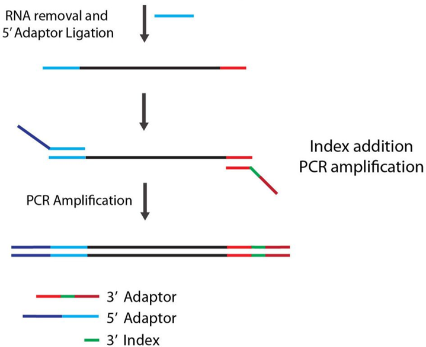
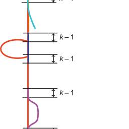
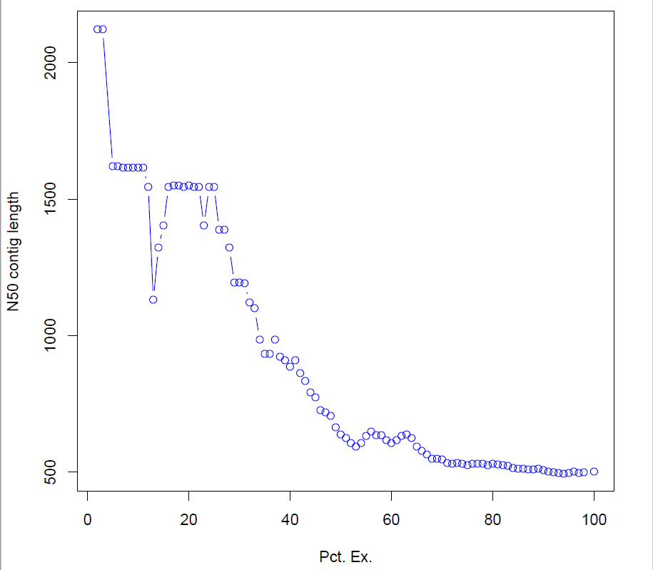
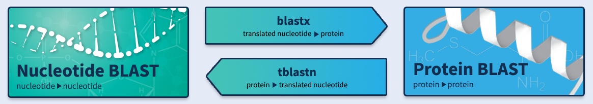
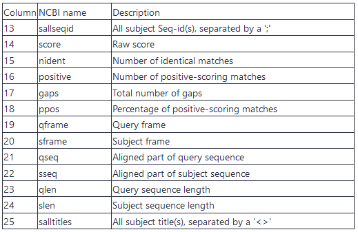
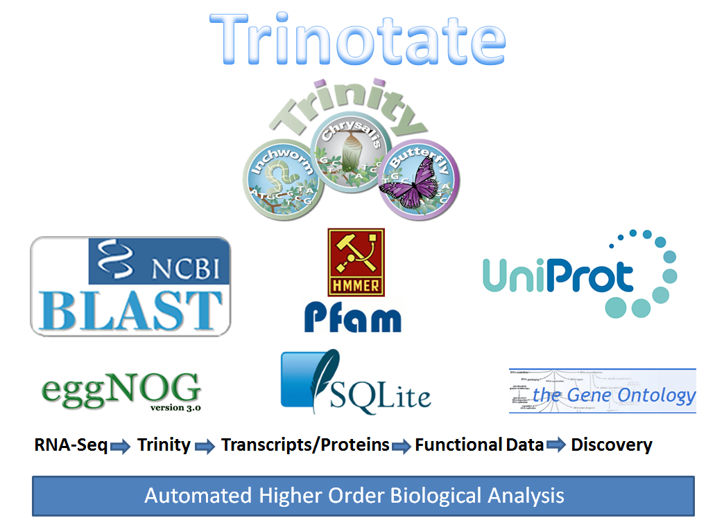
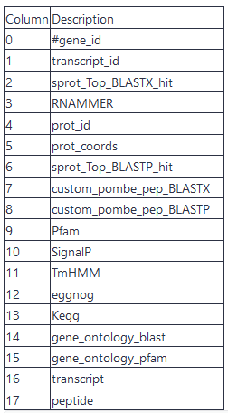

# Introduction
{:.no_toc}

<!-- This is a comment. -->

As a result of the development of novel sequencing technologies, the years between 2008 and 2012 saw a large drop in the cost of sequencing. Per megabase and genome, the cost dropped to 1/100,000th and 1/10,000th of the price, respectively. Prior to this, only transcriptomes of organisms that were of broad interest and utility to scientific research were sequenced; however, these developed in 2010s high-throughput sequencing (also called next-generation sequencing) technologies are both cost- and labor- effective, and the range of organisms studied via these methods is expanding.

Examining non-model organisms can provide novel insights into the mechanisms underlying the "diversity of fascinating morphological innovations" that have enabled the abundance of life on planet Earth. In animals and plants, the "innovations" that cannot be examined in common model organisms include mimicry, mutualism, parasitism, and asexual reproduction. De novo transcriptome assembly is often the preferred method to studying non-model organisms, since it is cheaper and easier than building a genome, and reference-based methods are not possible without an existing genome. The transcriptomes of these organisms can thus reveal novel proteins and their isoforms that are implicated in such unique biological phenomena.

[(source)](https://en.wikipedia.org/wiki/De_novo_transcriptome_assembly)

> ### Agenda
>
> In this tutorial, we will cover:
>
> 1. TOC
> {:toc}
>
{: .agenda}

# Get data (10 minutes)

To cover this tutorial, we will use a toy dataset dedicated to practise. This dataset is composed of 6 RNA-seq samples (paired-end sequencing, 100bp) downsampled to 10,000 reads.
The samples are transcriptomes of duck livers (*Anas platyrhynchos*) from 2 conditions (diet) : force-feeding (A) or not (B), with 3 replicates per condition. 

> ###  Hands-on: Data upload
>
> 1. **Create a new history for this tutorial**
>
>    
>
> 2. **Import the 12 `fq.gz` into a `List` collection named `fastq_raw` AND into a `List of Pairs` collection named `fastq_raw_paired`**
>    - Option 1: from a shared data library (ask your instructor)
>    - Option 2: from Zenodo using the URLs given below
>
>      [](https://doi.org/10.5281/zenodo.3541678)
>
>    ```
>    https://zenodo.org/record/3541678/files/A1_left.fq.gz
>    https://zenodo.org/record/3541678/files/A1_right.fq.gz
>    https://zenodo.org/record/3541678/files/A2_left.fq.gz
>    https://zenodo.org/record/3541678/files/A2_right.fq.gz
>    https://zenodo.org/record/3541678/files/A3_left.fq.gz
>    https://zenodo.org/record/3541678/files/A3_right.fq.gz
>    https://zenodo.org/record/3541678/files/B1_left.fq.gz
>    https://zenodo.org/record/3541678/files/B1_right.fq.gz
>    https://zenodo.org/record/3541678/files/B2_left.fq.gz
>    https://zenodo.org/record/3541678/files/B2_right.fq.gz
>    https://zenodo.org/record/3541678/files/B3_left.fq.gz
>    https://zenodo.org/record/3541678/files/B3_right.fq.gz
>    ```
>
>    
>    
>    
>    
>
> 3. When building collection `fastq_raw_paired`, associate each forward file to corresponding reverse file then rename each pair without extension, e.g. `A1`, `A2` etc.
> 3. **Check that the datatype is `fastq.gz`**
>
>    
>
> 4. **Add tag(s) to this dataset (for example : `RAW` and `FASTQ`)**
>
>    
>
{: .hands_on}

# Quality control and read cleaning (30 minutes)

The first step of every sequencing data analysis must be **quality control**.   
  
Indeed, there are many possible sources of bias arising from :
- **biological sampling** (contamination, low complexity...)
- **library preparation** (adapters and primers sequences, polyA/T tails...)
- **sequencing** (sequencing errors, optical duplicates, bad coverage...)   

As a result, sequencing reads might contain :
- Unknown nucleotides (Ns)
- Bad quality nucleotides
- Unwanted sequences
- Hexamers biases (Illumina. Now corrected ?) 
 
**Why do we need to correct those?**
- To remove a lot of sequencing errors (detrimental to the vast majority of assemblers)
- Because most de-bruijn graph based assemblers can’t handle unknown nucleotides


## Quality control with **fastqc**
   
To get an overview of the sequencing data quality, we will use [**fastqc** (Simon Andrews, 2010) ](https://www.bioinformatics.babraham.ac.uk/projects/fastqc/) : *"fastqc provides a modular set of analyses which you can use to give a quick impression of whether your data has any problems of which you should be aware before doing any further analysis."* 
    

> ###  Hands-on: Task description
>
> 1. **FastQC**  with the following parameters:
>   - *"Short read data from your current history"*: `fastq_raw` (collection)
> 2. **Rename and tag output collections**
>    - *"FastQC on collection XX: Webpage"* -> `FastQC_raw_Webpage`
>    - *"FastQC on collection XX: Webpage"* -> `FastQC_raw_data`
> 
> 
>   
{: .hands_on}

> ###  Questions
>
> What can you tell about the overall quality of the dataset ?
>
> > ###  Solution
> >
> > Click on "*FastQC_raw_Webpage*" box in your history to see all the 12 QC reports.  
> > You can see that it's not convenient at all to check the reports one by one !   
> > Let's use a very usefull tool in Bioinformatics : MultiQC.
> > 
> {: .solution}
>
{: .question}

> > ###  Comment
> >
> > For an exhaustive review of **fastqc** outputs, let's go to **Quality Control tutorial**.
> {: .comment}
>

Now we can use [**MultiQC** (P. Ewels et al., 2016)](https://multiqc.info/) to aggrate all individual results in one summary.

> ###  Hands-on: Task description
>
> 1. **MultiQC**  with the following parameters:
>    - In *"Results"*:
>        -  *"Insert Results"*
>            - *"Which tool was used generate logs?"*: `FastQC`
>                - In *"FastQC output"*: in dataset collections, select `FastQC_raw_data`
>                    - *"Type of FastQC output?"*: `Raw data`
>	 - *"Report title"*: `Training full-de-novo : raw QC` 
>	 - *"Use only flat plots (non-interactive images)"*: `No` 
>	 - *"Output the multiQC plots raw data?"*: `No`
>	 - *"Output the multiQC log file?"*: `No`
> 2. **Rename and tag output collection**
>    - *"MultiQC on data XX: Webpage"* -> `MultiQC_raw_Webpage`
>    - *"MultiQC on data XX: Stats"* -> `MultiQC_raw_Stats`
>
{: .hands_on}

> ###  Questions
>
> 1. If the Phred score of the mean quality of sequences at base 40 is higher than 30, what does it means ?
> 2. What can you tell about the overall quality of the dataset ? Is it Homogeneous ?
>
> > ###  Solution
> >
> > 1. It means that the sequencing error rate is less than 1 base in every 1,000 bases. Score Q = -10log(E)
> > 2. Yes but adapter trimming is necessary.
> >
> {: .solution}
>
{: .question}

>

<!-- ## Quality control with **MultiQC** - step 2/2

> ###  Hands-on: Task description
>
> 1. **MultiQC**  with the following parameters:
>    - In *"Results"*:
>        -  *"Insert Results"*
>            - *"Which tool was used generate logs?"*: `FastQC`
>                - In *"FastQC output"*:
>                    - *"Type of FastQC output?"*: `Raw data`
>                    - *"FastQC output"*: `data XX, data XX, and others (flattened)`
>
>    > ###  Comment
>    >
>    > We agree that it's not comfortable. The wrapper of MultiQC must be improved
>    {: .comment}
>
{: .hands_on} -->


<!-- ## Sequencing error correction with **Rcorrector**  
  
To address the sequencing errors in the raw sequencing reads, we can use [**Rcorrector** (Song et al., 2015)](https://github.com/mourisl/Rcorrector) : *a kmer-based error correction method for RNA-seq data, based on the path search algorithm.*  

"Rcorrector scans the read sequence and, at each position, decides whether the next k-mer and each of its alternatives are solid and represent valid continuations of the path. The path with the smallest number of differences from the read sequence, representing the likely transcript of origin, is then used to correct k-mers in the original read."

   

Path extension in Rcorrector. Four possible path continuations at the AGTC k-mer (k=4) in the De Bruijn graph for the r=AAGTCATAA read sequence. Numbers in the vertices represent k-mer counts. The first (top) path corresponds to the original read’s representation in the De Bruijn graph. The extension is pruned after the first step, AGTC →GTCA, as the count M(GTCA)=4 falls below the local cutoff (determined based on the maximum k-mer count (494) of the four possible successors of AGTC). The second path (yellow) has higher k-mer counts but it introduces four corrections, changing the read into AAGTCCGTC. The third path (blue) introduces only two corrections, to change the sequence into AAGTCGTTA, and is therefore chosen to correct the read. The fourth (bottom) path is pruned as the k-mer count for GTCT does not pass the threshold. Paths 2 and 3 are likely to indicate paralogs and/or splice variants of this gene.   


<!  ###  Hands-on: Task description
>
> 1. **Rcorrector**  with the following parameters: 
>    - *"Is this library paired- or single-end?"*: `Paired-end (as collection)`
>        - *"FastQ file R1 (left)"*: `R1`
>        - *"FastQ file R2 (right)"*: `R2`
>        - *"Filter uncorrectable reads"*: `Yes`
>    - *"Additional options"*: `No`   
> 2. **Rename the resulting datasets**
>    - `RNA-seq Rcorrector on XX ->  XX_corrected`  
> 
{: .hands_on}

> ###  Questions
>
> For sample **A1** :
> 1. how many reads were **corrected** ?
> 2. how many reads were **discarded** ?
> 3. what is the percentage of **remaining reads** ?
>
> > ###  Solution
> >
> > Click on "*RNA-seq Rcorrector on data XXX*" box in your history to get a report.
> > 1. `R1 corrected:488` et `R2 corrected:680`  
> > `pairs corrected:1016`
> > 2. `removed PE reads:4649`
> > 3. `53.51%`
> {: .solution}
>
{: .question} -->

## rRNA removal with **Bowtie2**  
  
One of the main source of contamination of RNA-seq samples is **ribosomal RNA**. Indeed, ~90% of total RNA correspond to rRNA. Before sequencing, ribodepletion and polyA selection are common mmethods to clean the samples, but it does not filter out all rRNA. After sequencing, remove rRNA reads from raw reads and detect rRNA transcripts might be usefull.

To do so, we use [**Bowtie 2**](https://github.com/BenLangmead/bowtie2) which is an ultrafast and memory-efficient tool for aligning sequencing reads to reference sequences. 
Here, the reference database will be [**Silva**](https://www.arb-silva.de/) : high quality ribosomal RNA database.

> ###  Hands-on: Task description
> 1. **Bowtie2**  with the following parameters:
>    - *"Is this single or paired library"*: `Paired-end Dataset Collection`
>	 - *"FASTQ Paired Dataset"* : `fastq_raw_paired`  
>        - *"Write unaligned reads (in fastq format) to separate file(s)"*: `Yes`
>        - *"Write aligned reads (in fastq format) to separate file(s)"*: `No`
>        - *"Do you want to set paired-end options?"*: `No`
>    - *"Will you select a reference genome from your history or use a built-in index?"*: `Use a built-in genome index`
>        - *"Select reference genome"*: `SILVA LSU+SSU Reference sequence databank`
>    - *"Set read groups information?"*: `Do not set`
>    - *"Select analysis mode"*: `1:Default setting only`
>        - *"Do you want to use presets?"*: `Very sensitive end-to-end (--very-sensitive)`
>    - *"Do you want to tweak SAM/BAM Options?"*: `No`
>    - *"Save the bowtie2 mapping statistics to the history"*: `Yes`
> 2. **Rename the resulting datasets**
>    - `Bowtie2 on collection XX: unaligned reads (R)` -> `R1_filtered_reads`     
>    - `Bowtie2 on collection XX: unaligned reads (L)` -> `R2_filtered_reads` 
>    - `Bowtie2 on collection XX: mapping stats` -> `filtered_reads_mapping_stats` 
>
{: .hands_on}

> ###  Questions
> 
> 1. For sample A3 :  
> 1.1. What is the mapping rate ? What does it means ?   
> 2. For sample A1 :  
> 2.1. What is mapping rate ?  
> 2.2. Which file should you continue the analysis with ?   
>
> > ###  Solution
> >
> > 1.1. 
> > ```
> > 0.00% overall alignment rate
> > ```
> > No rRNA was detected in the sample.   
> > 2.1.    
> > ```
> > 0.01% overall alignment rate  
> > ```   
> > 2.2. We should discard all read mapping to rRNA sequences and continue the analysis with **unmapped** reads.
> >
> {: .solution}
>
{: .question}

> ###  Other options
>  Other filtering strategiies can be used, like [**SortMeRNA** (Kopylova et al. 2012)](https://github.com/biocore/sortmerna), a tool developped to filter out rRNA from metatranscriptomic data. It is fast and it can discover new rRNA sequences.
> There are also HMM-based tools such as [**RNAmmer** (Lagesen et al. 2007)](https://www.ncbi.nlm.nih.gov/pmc/articles/PMC1888812/) and [**Barrnap** (Seemann et al. 2013)](https://github.com/tseemann/barrnap), which predicts the location of ribosomal RNA genes in genomes.
> 
{: .comment}

## Read cleaning with **Trimmomatic** 

   

> ###  Hands-on: Task description
>
> 1. **Trimmomatic**  with the following parameters:
>    - *"Single-end or paired-end reads?"*: `Paired-end (two separate input files)`
>    - *"Input FASTQ file (R1/first of pair)"*: `R1_filtered_reads`
>    - *"Input FASTQ file (R2/first of pair)"*: `R2_filtered_reads`
>    - *"Perform initial ILLUMINACLIP step?"*: `Yes`
>    - *"Adapter sequences to use"*: `TruSeq3 (additional seqs) (paired-ended, for MiSeq and HiSeq)`
>    - In *"Trimmomatic Operation"*:
>        -  *"Insert Trimmomatic Operation"*
>            - *"Select Trimmomatic operation to perform"*: `Cut bases off end of a read, if below a threshold quality (TRAILING)`
>        -  *"Insert Trimmomatic Operation"*
t_toy_dataset](../../images/full-de-novo/ExN50_plot_toy_dataset.png)
t](../../images/full-de-novo/ExN50_plot.png)
>            - *"Select Trimmomatic operation to perform"*: `Cut bases off start of a read, if below a threshold quality (LEADING)`
>        -  *"Insert Trimmomatic Operation"*
>            - *"Select Trimmomatic operation to perform"*: `Sliding window trimming (SLIDINGWINDOW)`
>        -  *"Insert Trimmomatic Operation"*
>            - *"Select Trimmomatic operation to perform"*: `Drop reads with average quality lower than a specific level (AVGQUAL)`
>                - *"Minimum length of reads to be kept"*: `25`
>        -  *"Insert Trimmomatic Operation"*
>            - *"Select Trimmomatic operation to perform"*: `Drop reads below a specified length (MINLEN)`
>                - *"Minimum length of reads to be kept"*: `50`
>    - *"Output trimmomatic log messages?"*: `Yes`
> 2. **Rename** the Dataset Collection
>    - `Trimmomatic on collection XX: paired` -> `R1_cleaned-reads`
>    - `Trimmomatic on collection XX: paired` -> `R2_cleaned_reads`
>
>    > ###  Comment
>    >
>    > You can check the Trimmomatic log files to get the number of reads before and after cleaning. To do so, click on the "show details" **i** icon, then click on *Tool Standard Output:stdout*
>    > ```
>    > Input Read Pairs: 10000
>    > Both Surviving: 8804 (88.04%)
>    > Forward Only Surviving: 491 (4.91%)
>    > Reverse Only Surviving: 456 (4.56%) Dropped: 249 (2.49%)
>    > ```
>    {: .comment}
>
>    
>
{: .hands_on}
>
>
> ###  Other option 
> You can also use [**Trim Galore** (Kueger et al. 2012)](https://github.com/FelixKrueger/TrimGalore), to trim raw sequencing data.
> 
{: .comment}


## Quality control after cleaning

> ###  Hands-on: Task description
>
> 1. **FastQC**  with the following parameters:
>   - *"Short read data from your current history"*: `R1_cleaned-reads` (collection)
> 2. **Rename** outputs : 
>    - `FastQC on collection XX : Webpage` -> `FastQC_R1_cleaned_Webpage` 
>    - `FastQC on collection XX : RawData` -> `FastQC_R1_cleaned_Raw` 
> 3. **FastQC**  with the following parameters:
>   - *"Short read data from your current history"*: `R2_cleaned-reads` (collection)
> 4. **Rename** outputs : 
>    - `FastQC on collection XX : Webpage` -> `FastQC_R2_cleaned_Webpage` 
>    - `FastQC on collection XX : RawData` -> `FastQC_R2_cleaned_Raw` 
>
{: .hands_on}

> ###  Hands-on: Task description
>
> 1. **MultiQC**  with the following parameters:
>    - In *"Results"*:
>        -  *"Insert Results"*
>            - *"Which tool was used generate logs?"*: `FastQC`
>                - In *"FastQC output"*: in dataset collections, select `FastQC_R1_cleaned`
>                    - *"Type of FastQC output?"*: `Raw data`
>        -  *"Insert Results"*
>            - *"Which tool was used generate logs?"*: `FastQC`
>                - In *"FastQC output"*: in dataset collections, select `FastQC_R2_cleaned`
>                    - *"Type of FastQC output?"*: `Raw data`
>	 - *"Report title"*: `Training full-de-novo : cleaned QC` 
>	 - *"Use only flat plots (non-interactive images)"*: `No` 
>	 - *"Output the multiQC plots raw data?"*: `No`
>	 - *"Output the multiQC log file?"*: `No`
> 2. **Rename and tag output collection**
>    - *"MultiQC on data XX: Webpage"* -> `MultiQC_cleaned_Webpage`
>    - *"MultiQC on data XX: Stats"* -> `MultiQC_cleaned_Stats`
>
{: .hands_on}

# Assembly (120 minutes - computing)

To get to the transcripts information, we need to reconstruct all full-length transcripts from short reads. Such operation requires dedicated assemblers as the process of assembling a transcriptome violates many of the assumptions of genomic assemblers. For example, uniform coverage and the ‘one locus – one contig’ paradigm are not valid for RNA. An accurate transcriptome assembler will produce one contig per distinct transcript (isoform) rather than per locus, and different transcripts will have different coverage, reflecting their different expression levels.

> ###  Comment
> 
> Do you want to learn more about the principles behind assembly? Follow our [training](https://training.galaxyproject.org/training-material/topics/assembly/tutorials/debruijn-graph-assembly/slides.html).
> 
{: .comment}


## Assembly with **Trinity**

We will use *Trinity*, a *de novo* transcriptome assembler for short sequencing reads.   
*Trinity* is the most widely used *de novo* transcriptome assembler and is in continuous development since several years. 
All information about Trinity assembler are here : [Trinity](https://github.com/trinityrnaseq/trinityrnaseq/wiki)


> ###  Hands-on: Task description
>
> 1. **Trinity**  with the following parameters:
>    - *"Are you pooling sequence datasets?"*: `Yes`
>        - *"Paired or Single-end data?"*: `Paired-end`
>            - *"Left/Forward strand reads"*: `R1_cleaned-reads`
>            - *"Right/Reverse strand reads"*: `R2_cleaned-reads`
>            - *"Strand specific data"*: `No`
>            - *"Jaccard Clip options"*: `No`
>    - *"Run in silico normalization of reads"*: `No`
>    - In *"Additional Options"*:
>        - *"Use the genome guided mode?"*: `No`
> 2. **Rename** Trinity outputs
>    - `Trinity on data XX, data YY, and others: Assembled Transcripts` -> `transcriptome_raw.fasta`
>    - `Trinity on data XX, data YY, and others: Gene to transcripts map` -> `Gene_to_transcripts_map_raw`
>
>    
>
{: .hands_on}

> ###  Questions
>
> 2. How are named the transcripts by Trinity in `transcriptome_raw.fasta` assembly ? What does it mean ?
> 1. What is the file `Gene_to_transcripts_map_raw` ?
>
> > ###  Solution
> >
> > 1. Trinity groups transcripts into clusters based on shared sequence content. Such a transcript cluster is very loosely referred to as a 'gene'. This information is encoded in the Trinity fasta accession. The accession encodes the Trinity 'gene' and 'isoform' information. For example, the accession 'TRINITY_DN1000_c115_g5_i1' indicates Trinity read cluster 'TRINITY_DN1000_c115', gene 'g5', and isoform 'i1'. The Path information stored in the header ("path=[31015:0-148 23018:149-246]") indicates the path traversed in the Trinity compacted de Bruijn graph to construct that transcript. 
> > 
> > 2. A Trinity gene is a collection of related transcripts. This file lists genes and related isoforms.
> > [Learn more about Trinity output.](https://github.com/trinityrnaseq/trinityrnaseq/wiki/Output-of-Trinity-Assembly)
> {: .solution}
>
{: .question}


> ###  Try it on!
> *rnaSPAdes* is a more recent assembler and can outperform *Trinity* results most of the time but not always. You can do
> the *de novo* assembly with **rnaSPAdes**  and compare the results!
> 
> 
> > ###  Hands-on: Task description
> >
> > 1. **rnaSPAdes**  with the following parameters:
> >   - *"Single-end or paired-end short-reads"*: `Paired-end: individual datasets`
> >   - *"Select optional output file(s)"*: `Transcripts`
> >
> {: .hands_on}
{: .comment}

> ###  Benchmarking
> [De novo transcriptome assembly: A comprehensive cross-species comparison of short-read RNA-Seq assemblers](https://academic.oup.com/gigascience/article/8/5/giz039/5488105)
> 
{: .comment}

# Assembly assessment / cleaning

The *de novo* transcriptome assembly needs to be evaluated before any further downstream analyses in order to check if it reaches sufficient quality criteria. We generally use 3 criteria to perform such analysis:
- **RNA-Seq read representation of the assembly** (i.e. coverage) to ensure that reads used for the assembly are mapped back to the assembled transcriptome.
- **Contiguity/metrics** such as the number of transcripts, isoforms, the N50, etc.
- **Completeness** according to conserved ortholog content.


<!--## Checking assembly statistics

**Trinity Statistics*** displays the summary statistics for a fasta file.

> ###  Hands-on: Task description
>
> 1. **Trinity Statistics**  with the following parameters:
>    - *"Trinity assembly"*: `transcriptome_raw.fasta`
>
>    > ###  Comment
>    > This step, even with this toy dataset, will take around 2 hours
>    {: .comment}
>
{: .hands_on}

> ###  Questions
>
> 1. TODO
>
> > ###  Solution
> >
> > 1. TODO
> >
> {: .solution}
>
{: .question}
-->

## Remapping reads on raw transcriptome

Remapping reads back to assembly aims to examine the RNA-Seq read representation of the assembly.

Several methods are available for estimating transcript abundance, including alignment-based methods 
(aligning reads to the transcript assembly) and alignment-free methods 
(examining k-mer abundances in the reads and in the resulting assembly).
Alignment-free methods such as Kallisto and Salmon are way more faster than alignment-based quantification methods.
In return, they cannot provide alignment files (BAM), only a coverage table.

Ideally, at least ~80% of input RNA-Seq reads are represented by the transcriptome assembly.
The remaining unassembled reads likely corresponds to lowly expressed transcripts with insufficient coverage to enable 
assembly, to low quality or aberrant reads.

> ###  Hands-on: Task description
>
> 1. **Align reads and estimate abundance**  with the following parameters:
>    - *"Transcripts"*: `transcriptome_raw.fasta`
>    - *"Gene to Transcripts map"*: `Gene_to_transcripts_map_raw`
>    - *"Paired or Single-end data?"*: `Paired`
>        - *"Left/Forward strand reads"* -> `R1_cleaned_reads`
>        - *"Right/Reverse strand reads"* -> `R2_cleaned_reads`
>        - *"Strand specific data"*: `Yes`
>    - *"Abundance estimation method"*: `RSEM`
>    - *"Alignment method"*: `Bowtie2`
>    - In *"Additional Options"*:
>        - *"Trinity assembly?"*: `Yes`
> 2. **Rename** the 6 `* isoforms counts` :(
>    -  `A1_raw`, `A2_raw`, `A3_raw`, `B1_raw`, `B2_raw`, `B3_raw`.
> 3. **Rename** output collection 
>    -  `Align reads and estimate abundance on collection XX: isoforms counts` -> `idoforms_counts_raw`
>
>    > ###  Comment
>    >
>    > If you check at the Standard Error messages of your outputs. You can get the `Mapping rate`
>    > 1. Click on one dataset
>    > 2. Click on the little **i** icon
>    > 3. Click on *Tool Standard Error:	stderr*
>    > Example for sample A1 :   
>    > ```
>    > 8803 reads; of these:
>    >   8803 (100.00%) were paired; of these:
>    >     4012 (45.58%) aligned concordantly 0 times
>    >     4640 (52.71%) aligned concordantly exactly 1 time
>    >     151 (1.72%) aligned concordantly >1 times
>    > 54.42% overall alignment rate
>    > ```
>    {: .comment}
>
>    > ###  Comment
>    >
>    > At this stage, you can now delete some useless datasets
>    > - `Trimmomatic on collection XX: unpaired`
>    > - `Align reads and estimate abundance on *: genes counts`
>    > - ...
>    > Note that the dataset are just hidden. You can delete them permanently and make some room in the history options (the little wheel icon)
>    {: .comment}
>
>
{: .hands_on}

## Merge the mapping tables and compute normalizations

> ###  Hands-on: Task description
>
> 1. **Build expression matrix**  with the following parameters:
>    - *"Abundance estimates"*: `isoforms_counts_raw`
>    - *"Gene to transcript correspondance"*: `Gene_to_transcript_raw`
>    - *"Abundance estimation method"*: `RSEM`
>
{: .hands_on}

> ###  Questions
>
> What are the three tables?
>
> > ###  Solution
> >
> > 1. `estimated RNA-Seq fragment isoform counts (raw counts)`
> > 2. `matrix of isoform TPM expression values (not cross-sample normalized)`
> > 3. `matrix of TMM-normalized expression values`
> >
> {: .solution}
>
{: .question}

## Compute contig Ex90N50 statistic and Ex90 transcript count

An alternative to the contig Nx statistic that could be considered more appropriate for transcriptome assembly data is the ExN50 statistic. Here, the N50 statistic is computed as usual but limited to the top most highly expressed genes that represent x% of the total normalized expression data. The gene expression is take as the sum of the transcript isoform expression and the gene length is computed as the expression-weighted mean of isoform lengths.

In case of Ex90N50, values are computed as usual N50 but limited to the top most highly expressed transcripts that represent 90% of the total normalized expression data. 

> ###  Hands-on: Task description
>
> 1. **Compute contig Ex90N50 statistic and Ex90 transcript count**  with the following parameters:
>    - *"Expression matrix"*: `Build expression matrix: matrix of TMM-normalized expression values`
>    - *"Transcripts"*: `transcriptome_raw.fasta`
>
>
{: .hands_on}

**What we get**


**What we should get with a real dataset**

[(source)](https://github.com/trinityrnaseq/trinityrnaseq/wiki/Transcriptome-Contig-Nx-and-ExN50-stats)


> ###  Other options 
> Other tools have been developped such as [**DETONATE** (Li et al. 2014)](https://github.com/deweylab/detonate), [**TransRate** (Smith-Una et al. 2016)](https://hibberdlab.com/transrate/) or [**rnaQUAST** (Bushmanova et al. 2016)](https://github.com/ablab/rnaquast) to evaluate transcriptome assembly quality.
> 
{: .comment}

## Transcriptome annotation completeness

[BUSCO (Benchmarking Universal Single-Copy Orthologs)](https://busco.ezlab.org/) allows a measure for quantitative assessment of genome/transcriptome/proteome based on evolutionarily informed expectations of gene content. 

> ###  Hands-on: Task description
>
> 1. **Busco**  with the following parameters:
>    - *"Sequence to analyse"*: `transcriptome_raw.fasta`
>    - *"Mode"*: `transcriptome`
>    - *"Lineage"*: `eukaryota_odb9`
>
{: .hands_on}


> ###  Questions
>
>  What can you say about the transcritome completeness ?
>
> > ###  Solution
> >
> >  You can click on the visualisation icon of the short summary :
> > ```
> > ***** Results: *****
> > 	C:0.4%[S:0.4%,D:0.0%],F:2.4%,M:97.2%,n:255	   
> > 	1	Complete BUSCOs (C)			   
> > 	1	Complete and single-copy BUSCOs (S)	   
> > 	0	Complete and duplicated BUSCOs (D)	   
> > 	6	Fragmented BUSCOs (F)			   
> > 	248	Missing BUSCOs (M)			   
> > 	255	Total BUSCO groups searched		   
> > ```
> > With the toy dataset, 97.2% of expected genes are missing in the assembly.
> {: .solution}
>
{: .question}

## Filter low expression transcripts

Most downstream analyses should be applied to the entire set of assembled transcripts, including functional annotation and differential expression analysis.
If you do decide that you want to filter transcripts to exclude those that are lowly expressed, you can use the following step.

Be cautious in filtering transcripts solely based on expression values, as you can easily discard biologically relevant transcripts from your data.
Ideally, any filtering would consider a combination of expression values and functional annotation data, and filtering is currently 
more of an art than a science, and again, simply not needed in most circumstances unless you have a very clear objective in doing so.

> ###  Hands-on: Task description
>
> 1. **Filter low expression transcripts**  with the following parameters:
>    - *"Trinity assembly"*: `transcriptome_raw.fasta`
>    - *"Expression matrix"*: `Build expression matrix: matrix of isoform TPM expression values (not cross-sample normalized)`
>    - *"Minimum expression level required across any sample"*: `1.0`
>    - *"Isoform filtering method"*: `Keep all isoforms above a minimum percent of dominant expression`
>        - *"Minimum percent of dominant isoform expression"*: `1`
>
>    > ###  Comment
>    >
>    > If you check at the Standard Error messages of your outputs. You can get the `Retained` rate
>    > 1. Click on one dataset
>    > 2. Click on the little **i** icon
>    > 3. Click on *Tool Standard Error:	stderr*
>    > ```
>    > 	Retained 1657 / 1663 = 99.64% of total transcripts.
>    > ```
>    {: .comment}
>
> 2. **Rename** the output
>    - `Filter low expression transcripts on data XX: filtered low expression transcripts` -> `transcriptome_filtered.fasta`
>
{: .hands_on}


<!--## Checking of the assembly statistics after cleaning

> ###  Hands-on: Task description
>
> 1. **Trinity Statistics**  with the following parameters:
>    - *"Trinity assembly"*: `transcriptome_filtered.fasta`
>
{: .hands_on}

> ###  Questions
>
> 1. TODO
>
> > ###  Solution
> >
> > 1. TODO
> >
> {: .solution}
>
{: .question}
-->

# Annotation

To get a robust transcriptome annotation, it is important to annotate the assembled transcripts and derived putative proteins as well.  
To do so, we will first predict coding regions then perform similarity search on UniprotKB/SwissProt. Then, we can search more precisely for transmembrane domains and protein profiles to refine the annotation. Finally, the results from previous steps can be summarized using Trinotate.  

## Generate gene to transcript map

We first need to generate a gene to transcripts map for the filtered transcriptome.
> ###  Hands-on: Task description
>
> 1. **Generate gene to transcript map**  with the following parameters:
>    - *"Trinity assembly"*: `transcriptome_filtered.fasta`
> 2. **Rename** output:
>    - `Generate Gene to transcripts map on data XX` : `Gene_to_transcripts_map_filtered`
>
{: .hands_on}

## Peptide prediction with **TransDecoder**

[TransDecoder](https://github.com/TransDecoder/TransDecoder/releases) identifies candidate coding regions within transcript sequences generated by Trinity. TransDecoder identifies candidate protein-coding regions based on nucleotide composition, open reading frame (ORF) length, and (optional) Pfam domain content.

TransDecoder identifies likely coding sequences based on the following criteria:
- an open reading frame (ORF) is found in a transcript sequence with length greater than threshold (usually 100)
- a log-likelihood score similar to what is computed by the GeneID software is > 0.
- the above coding score is greatest when the ORF is scored in the 1st reading frame as compared to scores in the other 5 reading frames.
- if a candidate ORF is found fully encapsulated by the coordinates of another candidate ORF, the longest one is reported. However, a single transcript can report multiple ORFs (allowing for operons, chimeras, etc).
- optional : the putative peptide has a match to a Pfam domain above the noise cutoff score.

> ###  Hands-on: Task description
>
> 1. **TransDecoder**  with the following parameters:
>    - *"Transcripts"*: `transcriptome_filtered.fasta`
>    - *"Minimum protein length"*: `100`
>    - In *"Training Options"*:
>        - *"Select the training method"*: `Train with the top longest ORFs`
>
{: .hands_on}

> ###  Questions
>
> What are the 4 generated files ?
>
> > ###  Solution
> >
> > **gff3** : a file to describe the predicted features in the transcriptome (`gene`, `mRNA`, `exon`,`CDS`,`3'UTR`,`5'UTR`)   
> > **bed** : feature coordinates file  
> > **cds** : sequence file, containing CDS (Coding DNA Sequences)  
> > **pep** : the most important file, which contains the protein sequences corresponding to the predicted coding regions within the transcripts.  
> > 
> {: .solution}
>
{: .question}

## Similarity search with **BLAST**



[**The Basic Local Alignment Search Tool (BLAST)**](https://blast.ncbi.nlm.nih.gov/Blast.cgi) finds regions of similarity between sequences. The program compares nucleotide or protein sequences and calculates the statistical significance of matches. BLAST can be used to infer functional and evolutionary relationships between sequences as well as help identify members of gene families.  
  
There are several types of BLAST searches, including:  
    - **BLASTp** (Protein BLAST): compares one or more protein query sequences to a subject protein sequence or a database of protein sequences. This is useful when trying to identify a protein.  
    - **BLASTx** (translated nucleotide sequence searched against protein sequences): compares a nucleotide query sequence that is translated in six reading frames (resulting in six protein sequences) against a database of protein sequences. Because blastx translates the query sequence in all six reading frames and provides combined significance statistics for hits to different frames, it is particularly useful when the reading frame of the query sequence is unknown or it contains errors that may lead to frame shifts or other coding errors. Thus blastx is often the first analysis performed with a newly determined nucleotide sequence. [Learn more about BLAST](https://guides.lib.berkeley.edu/ncbi/blast)  
    
Here, we will use **BLASTp** to search for similarities between the `.pep` protein sequences produces by TransDecoder and the proteins reported in the highly curated database [UniProtKB/SwissProt](https://www.uniprot.org/help/uniprotkb) (one record per gene in one species). Then we will use **BLASTx** to search for similarities between the filtered transcriptome nucleotide and [UniProtKB/SwissProt](https://www.uniprot.org/help/uniprotkb).  

> ###  Hands-on: Task description
>
> 1. **NCBI BLAST+ blastp**  with the following parameters:
>    - *"Protein query sequence(s)"*: `TransDecoder on data XXX: pep`
>    - *"Subject database/sequences"*: `Locally installed general BLAST database`
>    - *"Protein BLAST database"*: `UniprotKB/Swissprot`
>    - *"Type of BLAST"*: `Traditional BLASTP`
>    - *"Set expectation value cutoff"*: `0.001`
> 2. **NCBI BLAST+ blastx**  with the following parameters:
>    - *"Nucleotide query sequence(s)"*: `transcriptome_filtered.fasta`
>    - *"Subject database/sequences"*: `Locally installed general BLAST database`
>    - *"Protein BLAST database"*: `UniprotKB/Swissprot`
>    - *"Query genetic code"*: `Standard`
>    - *"Type of BLAST"*: `Traditional BLASTX`
>    - *"Set expectation value cutoff"*: `0.001`
> 3. **Rename** the BLASTP output
>    - `blastp on data XXX` -> `blastp`
> 4. **Rename** the BLASTX output
>    - `blastx on data XXX` -> `blastx`
>
{: .hands_on}

> ###  Questions
>
> What are the different columns in the resulting tab ?
>
> > ###  Solution
> >
> >  
> >  
> > 
> {: .solution}
>
{: .question}
<!--
## Find signal peptides

> ###  Hands-on: Task description
>
> 1. **SignalP 3.0**  with the following parameters:
>    - *"Fasta file of protein sequences"*: `TransDecoder on data XXX: pep`
>
{: .hands_on}
-->

## Find transmembrane domains with **TMHMM**

[**TMHMM** (Krogh et al, 2001)](https://services.healthtech.dtu.dk/service.php?TMHMM-2.0) predicts transmembrane helices from single sequence based on a hidden Markov model. The prediction gives the most probable location and orientation of transmembrane helices in the sequence. It is found by an algorithm called N-best (or 1-best in this case) that sums over all paths through the model with the same location and direction of the helices. 

> ###  Hands-on: Task description
>
> 1. **TMHMM 2.0**  with the following parameters:
>    - *"FASTA file of protein sequences"*: `TransDecoder on data XXX: pep`
>
{: .hands_on}

> ###  Questions
>
> 1. What are the different columns in the resulting tab ?
> 2. What does a Topology of `i` and `o` mean ?
>
> > ###  Solution
> >
> > 1. Each line starts with the sequence identifier and then these fields:  
> >    - `len`: the length of the protein sequence.  
> >    - `ExpAA`: The expected number of amino acids intransmembrane helices (see above).  
> >    - `First60`: The expected number of amino acids in transmembrane helices in the first 60 amino acids of the protein (see above).  
> >    - `PredHel`: The number of predicted transmembrane helices by N-best.  
> >    - `Topology` : The topology predicted by N-best.  
> > For example :  
> >    `TRINITY_DN104_c0_g1::TRINITY_DN104_c0_g1_i1::g.114::m.114	110	39.10	17.86	2	i43-60o65-87i`  
> > -> The topology is given as the position of the transmembrane helices separated by 'i' if the loop is on the inside or 'o' if it is on the outside. The above example 'i43-60o65-87i' means that it starts on the inside, has a predicted TMH at position 43 to 60, the outside, then a TMH at position 64-87 etc.  
> > 2. If the whole sequence is labeled as inside (i) or outside (o), the prediction is that it contains no membrane helices.  
> > 
> {: .solution}
>
{: .question}

## Search again profile database with **HMMscan** (HMMER)

[**HMMER (Finn et al, 2015)**](https://hmmer-web-docs.readthedocs.io/en/latest/about.html) is used to search sequence databases for sequence homologs, and to make sequence alignments. It implements methods using probabilistic models called profile hidden Markov models(profile HMMs).  

Here, we will use HMMscan to search homologs of the predicted coding regions in the transcripts (`.pep` file from TransDecoder) in [**Pfam**](https://pfam.xfam.org/) database.  

The Pfam database is a large collection of protein families, each represented by multiple sequence alignments and hidden Markov models (HMMs). 
Proteins are generally composed of one or more functional regions, commonly termed domains. Different combinations of domains give rise to the diverse range of proteins found in nature. The identification of domains that occur within proteins can therefore provide insights into their function.
Pfam also generates higher-level groupings of related entries, known as clans. A clan is a collection of Pfam entries which are related by similarity of sequence, structure or profile-HMM.
The data presented for each entry is based on the UniProt Reference Proteomes but information on individual UniProtKB sequences can still be found by entering the protein accession. Pfam full alignments are available from searching a variety of databases, either to provide different accessions (e.g. all UniProt and NCBI GI) or different levels of redundancy. 

> ###  Hands-on: Task description
>
> 1. **hmmscan**  with the following parameters:
>    - *"Use a built-in HMM model database"*
>    - *"Select a HMM model database"*: `Pfam-A`
>    - *"Sequence file"*: `TransDecoder on data XXX: pep`
>    - *Other options*: default
>
{: .hands_on}

## Transcriptome annotation using **Trinotate**



[**Trinotate**](https://github.com/Trinotate/Trinotate.github.io/blob/master/index.asciidoc) is a comprehensive annotation suite designed for automatic functional annotation of transcriptomes, particularly de novo assembled transcriptomes, from model or non-model organisms. Trinotate makes use of a number of different well referenced methods for functional annotation including homology search to known sequence data (BLAST+/SwissProt), protein domain identification (HMMER/PFAM), protein signal peptide and transmembrane domain prediction (signalP/tmHMM), and leveraging various annotation databases (eggNOG/GO/Kegg databases). All functional annotation data derived from the analysis of transcripts is integrated into a SQLite database which allows fast efficient searching for terms with specific qualities related to a desired scientific hypothesis or a means to create a whole annotation report for a transcriptome.


> ###  Hands-on: Task description
>
> 1. **Trinotate**  with the following parameters:
>    - *"Transcripts"*: `transcriptome_filtered.fasta`
>    - *"Peptides"*: `TransDecoder on data XXX: pep`
>    - *"Genes to transcripts map"*: `Gene_to_transcripts_map_filtered`
>    - *"BLASTP: Peptides vs Uniprot.SwissProt"*: `blastp`
>    - *"BLASTX: Transcripts vs Uniprot.SwissProt"*: `blastx`
>    - *"HMMER hmmscan: Peptides vs PFAM"*: `HMMSCAN on data XX: per_domain hits from HMM matches`
>    - *"TMHMM on Peptides"*: `TMHMM results`
>    - *"Let Galaxy downloading the Trinotate Pre-generated Resource SQLite database"*: `Yes`
>
{: .hands_on}

> ###  Questions
>
> What are the different columns in the resulting tab ?
>
> > ###  Solution
> >
> > 
> > 
> {: .solution}
>
{: .question}


# Differential Expression (DE) Analysis

## Remapping on the filtered transcriptome

> ###  Hands-on: Task description
>
> 1. **Align reads and estimate abundance**  with the following parameters:
>    - *"Transcripts"*: `transcriptome_filtered.fasta`
>    - *"Gene to Transcripts map"*: `Gene_to_transcripts_map_filtered`
>    - *"Paired or Single-end data?"*: `Paired`
>        - *"Left/Forward strand reads"* -> `R1_cleaned_reads`
>        - *"Right/Reverse strand reads"* -> `R2_cleaned_reads`
>        - *"Strand specific data"*: `Yes`
>    - *"Abundance estimation method"*: `RSEM`
>    - *"Alignment method"*: `Bowtie2`
>    - In *"Additional Options"*:
>        - *"Trinity assembly?"*: `Yes`
> 2. **Rename** the 6 `* isoforms counts` :(
>    -  `A1`, `A2`, `A3`, `B1`, `B2`, `B3`.
> 3. **Rename** output collection 
>    -  `Align reads and estimate abundance on collection XX: isoforms counts` -> `idoforms_counts_filtered`
>
>
>    > ###  Comment
>    >
>    > If you check at the Standard Error messages of your outputs. You can get the `Mapping rate`
>    > 1. Click on one dataset
>    > 2. Click on the little **i** icon
>    > 3. Click on *Tool Standard Error:	stderr*
>    > Example for sample A1 :   
>    > ```
>    > 8803 reads; of these:
>    >   8803 (100.00%) were paired; of these:
>    >     4012 (45.58%) aligned concordantly 0 times
>    >     4640 (52.71%) aligned concordantly exactly 1 time
>    >     151 (1.72%) aligned concordantly >1 times
>    > 54.42% overall alignment rate
>    > ```
>    {: .comment}
>    >
>
{: .hands_on}
> ###  Questions
>
> Do you expect the mapping rate on filtered transcriptome to be better than the mapping rate on raw transcriptome ?
>
> > ###  Solution
> >
> > The low expressed transcripts were discarded so it should not impact much the mapping rate. However on large dataset, the mapping should be faster.
> > 
> {: .solution}
>
{: .question}


## Merge the mapping tables and compute a TMM normalization

Unlike quality filter step, DE analysis requires to provide for each factor, counts of samples in each category.
After matrix creation, we will create a design sample file that will describe the experiment and the comparison we want.

> ###  Hands-on: Task description
>
> 1. **Build expression matrix**  with the following parameters:
>    - *"Abundance estimates"*: `isoforms_counts_filtered`
>    - *"Gene to transcript correspondance"*: `Gene_to _transcripts_map_filtered`
>    - *"Abundance estimation method"*: `RSEM`
>    - *"Cross sample normalization"*: `TMM`
> 2. **Describe samples**   with the following parameters:
>    - *"Samples"*
>        - *"1: Samples"*:
>            - *"Full sample name"*: `A1`
>            - *"Condition"*: `Force-feeding`
>        - *"2: Samples"*:
>            - *"Full sample name"*: `A2`
>            - *"Condition"*: `Force-feeding`
>        - ...:
>        - *"6: Samples"*:
>            - *"Full sample name"*: `B3`
>            - *"Condition"*: `Control`
>
{: .hands_on}

## RNASeq samples quality check

Once we've performed transcript quantification for each biological replicates, it's good to examine 
the data to ensure that biological replicates are well correlated, and also to investigate relationships among samples.

If there are any obvious discrepancies among sample and replicate relationships such as due to accidental 
mis-labeling of sample replicates, or strong outliers or batch effects, we want to identify them before 
proceeding to subsequent data analyses (such as differential expression).

> ###  Hands-on: Task description
> 1. **RNASeq samples quality check**  with the following parameters:
>    - *"Expression matrix"*: `Build expression matrix on data XX: estimated RNA-Seq fragment isoform counts (raw counts)`
>    - *"Samples description"*: `Describe samples`
>
{: .hands_on}

**RNASeq samples quality check** generated 4 outputs:

- **Pairwise comparisons of replicate** log(CPM) values. Data points more than 2-fold different are highlighted in red.
- **Pairwise MA plots** (x-axis: mean log(CPM), y-axis log(fold_change)).
- **Replicate Pearson correlation heatmap**. The heatmap gives an overview of similarities and dissimilarities between samples: the color represents the distance between the samples.
- **Principal Component Analysis (PCA)**. It shows the samples in the 2D plane spanned by their first two principal components. Each replicate is plotted as an individual data point. This type of plot is useful for visualizing the overall effect of experimental covariates and batch effects.


## Differential expression analysis

DESeq2 (Love et al. 2014) is a great tool for dealing with RNA-seq data and running Differential Gene Expression (DGE) analysis.
It takes read count files from different samples, combines them into a big table (with genes in the rows and samples in the columns)
and applies normalization for sequencing depth and library composition.

DESeq2 also runs the Differential Gene Expression (DGE) analysis, which has two basic tasks:

- Estimate the biological variance using the replicates for each condition
- Estimate the significance of expression differences between any two conditions

This expression analysis is estimated from read counts and attempts are made to correct for variability in measurements using replicates, 
that are absolutely essential for accurate results. 
For your own analysis, we advise you to use at least 3, but preferably 5 biological replicates per condition. 
It is possible to have different numbers of replicates per condition.

> ###  Hands-on: Task description
> 1. **Differential expression analysis**  with the following parameters:
>    - *"Expression matrix"*: `Build expression matrix: estimated RNA-Seq fragment isoform counts (raw counts)`
>    - *"Sample description"*: `Describe samples` (the last one)
>    - *"Differential analysis method"*: `DESeq2`
>
{: .hands_on}

The output from running the DE analysis containing files for each of the pairwise comparisons performed and the corresponding MA and volcano plot.

## Extract and cluster differentially expressed transcripts

An initial step in analyzing differential expression is to extract those transcripts that are most differentially 
expressed (most significant FDR and fold-changes) and to cluster the transcripts according to their 
patterns of differential expression across the samples.

> ###  Hands-on: Task description
>
> 1. **Extract and cluster differentially expressed transcripts**  with the following parameters:
>    - In *"Additional Options"*:
>        - *"Expression matrix"*: `Build expression matrix: estimated RNA-Seq fragment isoform counts (raw counts)`
>        - *"Sample description"*: `Describe samples`
>        - *"Differential expression results"*: `Differential expression results on data XXX and data XXX`
>        - *"p-value cutoff for FDR"*: `1`
>        - *"Run GO enrichment analysis"*: `No`
>
>    > ###  Comment
>    >
>    > *"p-value cutoff for FDR"*: `1`
>    > Don't do this at home! It's because we have a Toy Dataset. The cutoff should be around `0.001`
>    {: .comment}
>
{: .hands_on}

All genes that have P-values at most 1e-3 and are at least 2^2 fold differentially expressed are extracted for each of the earlier pairwise DE comparisons.
Different kinds of summary files and plots are generated:
- Sample correlation matrix heatmap
- DE gene vs. samples heatmap

To more seriously study and define your gene clusters, you will need to interact with the data as described below.
The clusters and all required data for interrogating and defining clusters is all saved with an R-session, 
locally with the file 'all.RData'.


## Partition genes into expression clusters

The DE genes shown in the above heatmap can be partitioned into gene clusters with similar expression patterns by one of several available methods.

There are three different methods for partitioning genes into clusters:
- Use K-means clustering to define K gene sets. This does not leverage the already hierarchically clustered genes as shown in the heatmap, and instead uses a least-sum-of-squares method to define exactly k gene clusters.
- Cut the hierarchically clustered genes into exactly K clusters.
- (Recommended) cut the hierarchically clustered gene tree at X percent height of the tree.


> ###  Hands-on: Task description
>
> 1. **Partition genes into expression clusters**  with the following parameters:
>    - *"RData file"*: `Extract and cluster differentially expressed transcripts: RData file`
>    - *"Method for partitioning genes into clusters"*: `Cut tree based on x percent of max(height) of tree`
>
{: .hands_on}

# Conclusion
{:.no_toc}

Sum up the tutorial and the key takeaways here. We encourage adding an overview image of the
pipeline used.
