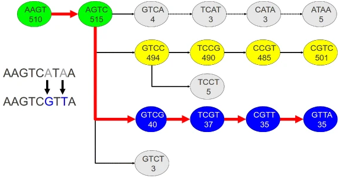

# Introduction
{:.no_toc}

<!-- This is a comment. -->

As a result of the development of novel sequencing technologies, the years between 2008 and 2012 saw a large drop in the cost of sequencing. Per megabase and genome, the cost dropped to 1/100,000th and 1/10,000th of the price, respectively. Prior to this, only transcriptomes of organisms that were of broad interest and utility to scientific research were sequenced; however, these developed in 2010s high-throughput sequencing (also called next-generation sequencing) technologies are both cost- and labor- effective, and the range of organisms studied via these methods is expanding.

Examining non-model organisms can provide novel insights into the mechanisms underlying the "diversity of fascinating morphological innovations" that have enabled the abundance of life on planet Earth. In animals and plants, the "innovations" that cannot be examined in common model organisms include mimicry, mutualism, parasitism, and asexual reproduction. De novo transcriptome assembly is often the preferred method to studying non-model organisms, since it is cheaper and easier than building a genome, and reference-based methods are not possible without an existing genome. The transcriptomes of these organisms can thus reveal novel proteins and their isoforms that are implicated in such unique biological phenomena.

[(source)](https://en.wikipedia.org/wiki/De_novo_transcriptome_assembly)

> ### Agenda
>
> In this tutorial, we will cover:
>
> 1. TOC
> {:toc}
>
{: .agenda}

# Read cleaning (20 minutes)

Known sequencing biases:
- Unknown nucleotides (Ns)
- Bad quality nucleotides
- Hexamers biases (Illumina. Now corrected ?)

Why do we need to correct those?
- To remove a lot of sequencing errors (detrimental to the vast majority of assemblers)
- Because most de-bruijn graph based assemblers can’t handle unknown nucleotides

## Get data

> ###  Hands-on: Data upload
>
> 1. Create a new history for this tutorial
>
>    
>
> 2. Import the 12 `fq.gz` into a `List of Pairs` collection named `fastq_raw`
>    - Option 1: from a shared data library (ask your instructor)
>    - Option 2: from Zenodo using the URLs given below
>
>      [](https://doi.org/10.5281/zenodo.3541678)
>
>    ```
>    https://zenodo.org/record/3541678/files/A1_left.fq.gz
>    https://zenodo.org/record/3541678/files/A1_right.fq.gz
>    https://zenodo.org/record/3541678/files/A2_left.fq.gz
>    https://zenodo.org/record/3541678/files/A2_right.fq.gz
>    https://zenodo.org/record/3541678/files/A3_left.fq.gz
>    https://zenodo.org/record/3541678/files/A3_right.fq.gz
>    https://zenodo.org/record/3541678/files/B1_left.fq.gz
>    https://zenodo.org/record/3541678/files/B1_right.fq.gz
>    https://zenodo.org/record/3541678/files/B2_left.fq.gz
>    https://zenodo.org/record/3541678/files/B2_right.fq.gz
>    https://zenodo.org/record/3541678/files/B3_left.fq.gz
>    https://zenodo.org/record/3541678/files/B3_right.fq.gz
>    ```
>
>    
>    
>
> 3. Rename the datasets
> 4. Check that the datatype
>
>    
>
> 5. Add to each database a tag corresponding to ...
>
>    
>
{: .hands_on}

## Quality control  
   
The first step of every sequencing data analysis must be **quality control**.   
  
Indeed, there are many possible sources of bias arising from :
- **biological sampling** (contamination, low complexity...)
- **library preparation** (adapters and primers sequences, polyA/T tails...)
- **sequencing** (sequencing errors, optical duplicates, bad coverage...)   
    
To get an overview of the sequencing data quality, we will use [**fastqc** (Simon Andrews, 2010) ](https://www.bioinformatics.babraham.ac.uk/projects/fastqc/) : *"fastqc provides a modular set of analyses which you can use to give a quick impression of whether your data has any problems of which you should be aware before doing any further analysis."* 

> ###  Hands-on: Task description
>
> 1. **FastQC**  with the following parameters:
>   - *"Short read data from your current history"*: `fastq_raw` (collection)
>
{: .hands_on}

###  Questions
>
> 1. TODO
>
> > ###  Solution
> >
> > 1. TODO
> >
> {: .solution}
>
{: .question}

<!-- ## Quality control with **MultiQC** - step 2/2

> ###  Hands-on: Task description
>
> 1. **MultiQC**  with the following parameters:
>    - In *"Results"*:
>        -  *"Insert Results"*
>            - *"Which tool was used generate logs?"*: `FastQC`
>                - In *"FastQC output"*:
>                    - *"Type of FastQC output?"*: `Raw data`
>                    - *"FastQC output"*: `data XX, data XX, and others (flattened)`
>
>    > ###  Comment
>    >
>    > We agree that it's not comfortable. The wrapper of MultiQC must be improved
>    {: .comment}
>
{: .hands_on} -->


## Sequencing error correction with **Rcorrector**  
  
To address the sequencing errors in the raw sequencing reads, we can use [**Rcorrector** (Song et al., 2015)](https://github.com/mourisl/Rcorrector) : *a kmer-based error correction method for RNA-seq data, based on the path search algorithm.*  

"Rcorrector scans the read sequence and, at each position, decides whether the next k-mer and each of its alternatives are solid and represent valid continuations of the path. The path with the smallest number of differences from the read sequence, representing the likely transcript of origin, is then used to correct k-mers in the original read."

   

Path extension in Rcorrector. Four possible path continuations at the AGTC k-mer (k=4) in the De Bruijn graph for the r=AAGTCATAA read sequence. Numbers in the vertices represent k-mer counts. The first (top) path corresponds to the original read’s representation in the De Bruijn graph. The extension is pruned after the first step, AGTC →GTCA, as the count M(GTCA)=4 falls below the local cutoff (determined based on the maximum k-mer count (494) of the four possible successors of AGTC). The second path (yellow) has higher k-mer counts but it introduces four corrections, changing the read into AAGTCCGTC. The third path (blue) introduces only two corrections, to change the sequence into AAGTCGTTA, and is therefore chosen to correct the read. The fourth (bottom) path is pruned as the k-mer count for GTCT does not pass the threshold. Paths 2 and 3 are likely to indicate paralogs and/or splice variants of this gene.   
   

> ###  Hands-on: Task description
>
> 1. **Rcorrector**  with the following parameters: 
>    - *"Is this library paired- or single-end?"*: `Paired-end (as collection)`
>        - *"FastQ file R1 (left)"*: `R1`
>        - *"FastQ file R2 (right)"*: `R2`
>        - *"Filter uncorrectable reads"*: `Yes`
>    - *"Additional options"*: `No`   
> 2. **Rename the resulting datasets**
>    - `RNA-seq Rcorrector on XX ->  XX_corrected`  
> 
{: .hands_on}

> ###  Questions
>
> For sample **A1** :
> 1. how many reads were **corrected** ?
> 2. how many reads were **discarded** ?
> 3. what is the percentage of **remaining reads** ?
>
> > ###  Solution
> >
> > Click on "*RNA-seq Rcorrector on data XXX*" box in your history to get a report.
> > 1. `R1 corrected:488` et `R2 corrected:680`  
> > `pairs corrected:1016`
> > 2. `removed PE reads:4649`
> > 3. `53.51%`
> {: .solution}
>
{: .question}

## rRNA removal with **Bowtie2**  
  
One of the main source of contamination of RNA-seq samples is **ribosomal RNA**. Indeed, ~90% of total RNA correspond to rRNA. Before sequencing, ribodepletion and polyA selection are common mmethods to clean the samples, but it does not filter out all rRNA. After sequencing, removal rRNA reads from raw reads and detect rRNA transcripts might usefull.

To do so, we use [**Bowtie 2**](https://github.com/BenLangmead/bowtie2) which is an ultrafast and memory-efficient tool for aligning sequencing reads to reference sequences. 
Here, the reference database will be [**Silva**](https://www.arb-silva.de/) : high quality ribosomal RNA database.

> ###  Hands-on: Task description
> 1. **Bowtie2**  with the following parameters:
>    - *"Is this single or paired library"*: `Paired-end`
>        - *"FASTA/Q file #1"*: `R1_corrected`
>        - *"FASTA/Q file #2"*: `R2_corrected`
>        - *"Write unaligned reads (in fastq format) to separate file(s)"*: `Yes`
>        - *"Write aligned reads (in fastq format) to separate file(s)"*: `No`
>        - *"Do you want to set paired-end options?"*: `No`
>    - *"Will you select a reference genome from your history or use a built-in index?"*: `Use a built-in genome index`
>        - *"Select reference genome"*: `Silva Ribosomal Database`
>    - *"Set read groups information?"*: `Do not set`
>    - *"Select analysis mode"*: `1:Default setting only`
>        - *"Do you want to use presets?"*: `Very sensitive end-to-end (--very-sensitive)`
>    - *"Do you want to tweak SAM/BAM Options?"*: `No`
>    - *"Save the bowtie2 mapping statistics to the history"*: `Yes`
> 2. **Rename the resulting datasets**
>    - `Bowtie2 on XX: alignments -> `     
>
{: .hands_on}

###  Questions
>
> 1. TODO
> 2. TODO
>
> > ###  Solution
> >
> > 1. TODO
> > 2. TODO
> >
> {: .solution}
>
{: .question}


## Read cleaning with **Trimmomatic** 


> ###  Hands-on: Task description
>
> 1. **Trimmomatic**  with the following parameters:
>    - *"Single-end or paired-end reads?"*: `Paired-end (as collection)`
>    - *"Select FASTQ dataset collection with R1/R2 pair"*: `Raw Data`
>    - *"Perform initial ILLUMINACLIP step?"*: `Yes`
>    - *"Adapter sequences to use"*: `TruSeq3 (additional seqs) (paired-ended, for MiSeq and HiSeq)`
>    - In *"Trimmomatic Operation"*:
>        -  *"Insert Trimmomatic Operation"*
>            - *"Select Trimmomatic operation to perform"*: `Cut bases off end of a read, if below a threshold quality (TRAILING)`
>        -  *"Insert Trimmomatic Operation"*
t_toy_dataset](../../images/full-de-novo/ExN50_plot_toy_dataset.png)
t](../../images/full-de-novo/ExN50_plot.png)
>            - *"Select Trimmomatic operation to perform"*: `Cut bases off start of a read, if below a threshold quality (LEADING)`
>        -  *"Insert Trimmomatic Operation"*
>            - *"Select Trimmomatic operation to perform"*: `Sliding window trimming (SLIDINGWINDOW)`
>        -  *"Insert Trimmomatic Operation"*
>            - *"Select Trimmomatic operation to perform"*: `Drop reads with average quality lower than a specific level (AVGQUAL)`
>                - *"Minimum length of reads to be kept"*: `25`
>        -  *"Insert Trimmomatic Operation"*
>            - *"Select Trimmomatic operation to perform"*: `Drop reads below a specified length (MINLEN)`
>                - *"Minimum length of reads to be kept"*: `50`
>    - *"Output trimmomatic log messages?"*: `Yes`
> 2. **Rename** the Dataset Collection
>    - `Trimmomatic on collection XX: paired` -> `fastqc_cleaned`
>
>    > ###  Comment
>    >
>    > You can check the Trimmomatic log files to get the number of read before and after the cleaning. To do se, click on the "show details" **i** icon, then click on *Tool Standard Output:stdout*
>    > ```
>    > Input Read Pairs: 10000
>    > Both Surviving: 8804 (88.04%)
>    > Forward Only Surviving: 491 (4.91%)
>    > Reverse Only Surviving: 456 (4.56%) Dropped: 249 (2.49%)
>    > ```
>    {: .comment}
>
>    
>
{: .hands_on}

## Quality control after cleaning

> ###  Hands-on: Task description
>
> 1. **FastQC**  with the following parameters:
>   - *"Short read data from your current history"*: `fastqc_cleaned` (collection)
>
{: .hands_on}

# Assembly (120 minutes - computing)

To acceses at the transcritps information, we need to reconstruct all full-length transcripts from short reads. Such operation require dedicated assemblers as the process of assembling a transcriptome violates many of the assumptions of genomic assemblers. For example, uniform coverage and the ‘one locus – one contig’ paradigm are not valid for RNA. An accurate transcriptome assembler will produce one contig per distinct transcript (isoform) rather than per locus, and different transcripts will have different coverage, reflecting their different expression levels.

> ###  Comment
> 
> Do you want to learn more about the principles behind assembly? Follow our [training](https://training.galaxyproject.org/training-material/topics/assembly/tutorials/debruijn-graph-assembly/slides.html).
> 
{: .comment}

We will use *Trinity*, a de novo transcriptome assembler for short sequencing reads. 
*Trinity* is the most widely used de novo transcriptome assembler and in continuous development since several years.
All information about Trinity assembler are here [Trinity](https://github.com/trinityrnaseq/trinityrnaseq/wiki)

## Assembly with **Trinity**

> ###  Hands-on: Task description
>
> 1. **Trinity**  with the following parameters:
>    - *"Are you pooling sequence datasets?"*: `Yes`
>        - *"Paired or Single-end data?"*: `Paired-end collection`
>            - *"Strand specific data"*: `No`
>    - *"Run in silico normalization of reads"*: `No`
>    - In *"Additional Options"*:
>        - *"Use the genome guided mode?"*: `No`
> 2. **Rename** the Trinity output
>    - `Trinity on data 52, data 51, and others: Assembled Transcripts` -> `transcriptome_raw.fasta`
>
>    
>
{: .hands_on}

> ###  Questions
>
> 1. TODO
>
> > ###  Solution
> >
> > 1. TODO
> >
> {: .solution}
>
{: .question}


> ###  Try it on!
> *rnaSPAdes* is a most recent assembler and can outperform *Trinity* results most of the time but not always. You can do
> the de novo assembly with **rnaSPAdes**  and compare the results!
> 
> 
> > ###  Hands-on: Task description
> >
> > 1. **rnaSPAdes**  with the following parameters:
> >   - *"Single-end or paired-end short-reads"*: `Paired-end: individual datasets`
> >   - *"Select optional output file(s)"*: `Transcripts`
> >
> {: .hands_on}
{: .comment}

> ###  Benchmarking
> [De novo transcriptome assembly: A comprehensive cross-species comparison of short-read RNA-Seq assemblers](https://academic.oup.com/gigascience/article/8/5/giz039/5488105)
> 
{: .comment}

# Assembly assessment / cleaning

The de novo transcriptome assembly needs to be evaluated before any further downstream analyses in order to check if it reach sufficient quality criterion. We generally use 3 criterons to perform such analysis:
- The contiguity/metrics such as the number of transcripts, isoforms, the N50, etc.
- The completeness according to conserved ortholog content.
- The RNA-Seq read representation of the assembly (i.e. coverage) to ensure that reads using for the assembly are mapped back to the assembled transcriptome.

Other criterions/software can be used, as:

- The representation of full-length reconstructed protein-coding genes, by searching the assembled transcripts against a database of known protein sequences.
- Compute DETONATE scores. DETONATE provides a rigorous computational assessment of the quality of a transcriptome assembly, and is useful if you want to run several assemblies using different parameter settings or using altogether different tools. That assembly with the highest DETONATE score is considered the best one.
- TransRate generates a number of useful statistics for evaluating your transcriptome assembly. Read about TransRate here: http://genome.cshlp.org/content/26/8/1134. Note that certain statistics may be biased against the large numbers of transcripts that are very lowly expressed. Consider generating TransRate statistics for your transcriptome before and after applying a minimum expression-based filter.
- rnaQUAST a quality assessment tool for de novo transcriptome assemblies.


## Checking of the assembly statistics

***Trinity Statistics*** displays the summary statistics for a fasta file.

> ###  Hands-on: Task description
>
> 1. **Trinity Statistics**  with the following parameters:
>    - *"Trinity assembly"*: `transcriptome_raw.fasta`
>
>    > ###  Comment
>    > This step, even with this toy dataset, will take around 2 hours
>    {: .comment}
>
{: .hands_on}

> ###  Questions
>
> 1. TODO
>
> > ###  Solution
> >
> > 1. TODO
> >
> {: .solution}
>
{: .question}


## Remapping on the raw transcriptome

This step aims to Examine the RNA-Seq read representation of the assembly.
Ideally, at least ~80% of your input RNA-Seq reads are represented by your transcriptome assembly.
The remaining unassembled reads likely corresponds to lowly expressed transcripts with insufficient coverage to enable 
assembly, or are low quality or aberrant reads.

Several methods available for estimating transcript abundance and these include alignment-based methods 
(aligning reads to the transcript assembly) and alignment-free methods 
(examining k-mer abundances in the reads and in the resulting assembly).

Alignment-free method such as Kallisto and Salmon are way more faster than alignment-based quantification methods.
In return, they cannot provide alignment files (BAM), only a coverage table.

> ###  Hands-on: Task description
>
> 1. **Align reads and estimate abundance**  with the following parameters:
>    - *"Transcripts"*: `transcriptome_raw.fasta`
>    - *"Paired or Single-end data?"*: `Paired`
>        - *"Left/Forward strand reads"* -> `Multiple datasets`
>            - Click on the *Folder* button at the right
>                - *Type to Search*: `left`
>                - Select the 6 `Trimmomatic on ..._left.fq.gz`
>        - *"Right/Reverse strand reads"* -> `Multiple datasets`
>            - Click on the *Folder* button at the right
>                - *Type to Search*: `right`
>                - Select the 6 `Trimmomatic on ..._left.fq.gz`
>        - *"Strand specific data"*: `Yes`
>    - *"Abundance estimation method"*: `Salmon`
>    - In *"Additional Options"*:
>        - *"Trinity assembly?"*: `Yes`
> 2. **Rename** the 6 `* isoforms counts` :(
>    - Check in the information panel (**i** icon) the lineage of your file (ex: `A1_left.fq.gz` ... )
>    - Rename the datasets: `A1_raw`, `A2_raw`, `A3_raw`, `B1_raw`, `B2_raw`, `B3_raw`.
>
>    > ###  Comment
>    >
>    > If you check at the Standard Error messages of your outputs. You can get the `Mapping rate`
>    > 1. Click on one dataset
>    > 2. Click on the little **i** icon
>    > 3. Click on *Tool Standard Error:	stderr*
>    > ```
>    > [2019-11-14 15:44:21.500] [jointLog] [info] Mapping rate = 44.4358%
>    > ```
>    {: .comment}
>
>    > ###  Comment
>    >
>    > At this stage, you can now delete some useless datasets
>    > - `Trimmomatic on collection XX: unpaired`
>    > - `Align reads and estimate abundance on *: genes counts`
>    > Note that the dataset are just hidden. You can delete them permanently and make some room in the history options (the little wheel icon)
>    {: .comment}
>
>
{: .hands_on}

> ###  Questions
>
> 1. TODO
>
> > ###  Solution
> >
> > 1. TODO
> >
> {: .solution}
>
{: .question}

## Merge the mapping tables and compute normalizations

> ###  Hands-on: Task description
>
> 1. **Build expression matrix**  with the following parameters:
>    - *"Abundance estimates"*: `A1_raw`, `A2_raw`, `A3_raw`, `B1_raw`, `B2_raw`, `B3_raw`
>    - *"Abundance estimation method"*: `Salmon`
>
{: .hands_on}

> ###  Questions
>
> What are the three tables?
>
> > ###  Solution
> >
> > 1. `estimated RNA-Seq fragment isoform counts (raw counts)``
> > 2. `matrix of isoform TPM expression values (not cross-sample normalized)`
> > 3. `matrix of TMM-normalized expression values`
> >
> {: .solution}
>
{: .question}

## Compute contig Ex90N50 statistic and Ex90 transcript count

### Definition

Ex90N50 values are computed as usual N50 but limited to the top most highly expressed transcripts that represent 90% of the total normalized expression data. 

> ###  Hands-on: Task description
>
> 1. **Compute contig Ex90N50 statistic and Ex90 transcript count**  with the following parameters:
>    - *"Expression matrix"*: `Build expression matrix: matrix of TMM-normalized expression values`
>    - *"Transcripts"*: `transcriptome_raw.fasta`
> 2. Click on the visulization icon on the dataset `Compute contig Ex90N50 statistic and Ex90 transcript count: ExN50 statistics`
>    1. **Scatterplot - Creates a 2D-scatterplot from tabular datapoints**
>    2. *"X Column"*: select the Columns `1`
>    3. *"Y Column"*: select the Columns `2`
>
{: .hands_on}

### What we get


### What we should get with a real dataset

[(source)](https://github.com/trinityrnaseq/trinityrnaseq/wiki/Transcriptome-Contig-Nx-and-ExN50-stats)

## Transcriptome annotation completeness

BUSCO (Benchmarking Universal Single-Copy Orthologs) allows a measure for quantitative assessment of genome/transcriptome/proteome based on evolutionarily informed expectations of gene content. Details for this tool are here: [BUSCO](https://busco.ezlab.org/)

> ###  Hands-on: Task description
>
> 1. **Busco**  with the following parameters:
>    - *"Sequence to analyse"*: `transcriptome_raw.fasta`
>    - *"Mode"*: `transcriptome`
>    - *"Lineage"*: `eukaryota_odb9`
>
{: .hands_on}


> ###  Questions
>
> 1. TODO
>
> > ###  Solution
> >
> > 1. TODO
> >
> {: .solution}
>
{: .question}

## Filter low expression transcripts

Most downstream analyses should be applied to the entire set of assembled transcripts, including functional annotation and differential expression analysis.
If you do decide that you want to filter transcripts to exclude those that are lowly expressed, you can use the following step.

Be cautious in filtering transcripts solely based on expression values, as you can easily discard biologically relevant transcripts from your data.
Ideally, any filtering would consider a combination of expression values and functional annotation data, and filtering is currently 
more of an art than a science, and again, simply not needed in most circumstances unless you have a very clear objective in doing so.

> ###  Hands-on: Task description
>
> 1. **Filter low expression transcripts**  with the following parameters:
>    - *"Trinity assembly"*: `transcriptome_raw.fasta`
>    - *"Expression matrix"*: `Build expression matrix: matrix of isoform TPM expression values (not cross-sample normalized)`
>    - *"Minimum expression level required across any sample"*: `1.0`
>    - *"Isoform filtering method"*: `Keep all isoforms above a minimum percent of dominant expression`
>        - *"Minimum percent of dominant isoform expression"*: `1`
>
>    > ###  Comment
>    >
>    > If you check at the Standard Error messages of your outputs. You can get the `Retained` rate
>    > 1. Click on one dataset
>    > 2. Click on the little **i** icon
>    > 3. Click on *Tool Standard Error:	stderr*
>    > ```
>    > 	Retained 2096 / 2102 = 99.71% of total transcripts.
>    > ```
>    {: .comment}
>
> 2. **Rename** the output
>    - `Filter low expression transcripts on data 42 and data 14: filtered low expression transcripts` -> `transcriptome_filtered.fasta`
>
{: .hands_on}

> ###  Questions
>
> 1. TODO
>
> > ###  Solution
> >
> > 1. TODO
> >
> {: .solution}
>
{: .question}


## Checking of the assembly statistics after cleaning

> ###  Hands-on: Task description
>
> 1. **Trinity Statistics**  with the following parameters:
>    - *"Trinity assembly"*: `transcriptome_filtered.fasta`
>
{: .hands_on}

> ###  Questions
>
> 1. TODO
>
> > ###  Solution
> >
> > 1. TODO
> >
> {: .solution}
>
{: .question}

# Annotation
## Generate gene to transcript map

To get a robust transcriptome annotation, it is important to annotate the assembled transcripts and derived putative proteins as well.  
To do so, we will first predict coding regions then perform similarity search on UniprotKB/SwissProt. Then, we can seach for signal peptides, transmembrane domains and profiles to refine the annotation. Finally, the results from previous steps can be summarized using Trinotate.  

> ###  Hands-on: Task description
>
> 1. **Generate gene to transcript map**  with the following parameters:
>    - *"Trinity assembly"*: `transcriptome_filtered.fasta`
>
{: .hands_on}

## Peptide prediction with **TransDecoder**

[TransDecoder](https://github.com/TransDecoder/TransDecoder/releases) identifies candidate coding regions within transcript sequences generated by Trinity. TransDecoder identifies candidate protein-coding regions based on nucleotide composition, open reading frame (ORF) length, and (optional) Pfam domain content.

TransDecoder identifies likely coding sequences based on the following criteria:
	- a minimum length open reading frame (ORF) is found in a transcript sequence
	- a log-likelihood score similar to what is computed by the GeneID software is > 0.
	- the above coding score is greatest when the ORF is scored in the 1st reading frame as compared to scores in the other 5 reading frames.
	- if a candidate ORF is found fully encapsulated by the coordinates of another candidate ORF, the longer one is reported. However, a single transcript can report multiple ORFs (allowing for operons, chimeras, etc).
	- optional the putative peptide has a match to a Pfam domain above the noise cutoff score.


> ###  Hands-on: Task description
>
> 1. **TransDecoder**  with the following parameters:
>    - *"Transcripts"*: `transcriptome_filtered.fasta`
>    - In *"Training Options"*:
>        - *"Select the training method"*: `Train with the top longest ORFs`
>
{: .hands_on}

## Similarity search

> ###  Hands-on: Task description
>
> 1. **Diamond**  with the following parameters:
>    - *"What do you want to align?"*: `Align amino acid query sequences (blastp)`
>    - *"Input query file in FASTA or FASTQ format"*: `TransDecoder on data XXX: pep`
>    - *"Select a reference database"*: `Uniprot Swissprot`
>    - *"Format of output file"*: `BLAST Tabular`
>    - In *"Method to restrict the number of hits?"*: `Maximum number of target sequences`
>        - *"The maximum number of target sequence per query to report alignments for"*: `1`
> 3. **Rename** the Diamond output
>    - `Diamond on data XXX` -> `Diamond (blastp)`
> 2. **Diamond**  with the following parameters:
>    - *"What do you want to align?"*: `Align DNA query sequences (blastx)`
>    - *"Input query file in FASTA or FASTQ format"*: `transcriptome_filtered.fasta`
>    - *"Select a reference database"*: `Uniprot Swissprot`
>    - *"Format of output file"*: `BLAST Tabular`
>    - In *"Method to restrict the number of hits?"*: `Maximum number of target sequences`
>        - *"The maximum number of target sequence per query to report alignments for"*: `1`
> 4. **Rename** the Diamond output
>    - `Diamond on data XXX` -> `Diamond (blastx)`
>
>    > ###  Comment
>    >
>    > Note that you can both use **Diamond**  or the **NCBI BLAST+ blastp**  and **NCBI BLAST+ blast** 
>    {: .comment}
>
{: .hands_on}

## Find signal peptides

> ###  Hands-on: Task description
>
> 1. **SignalP 3.0**  with the following parameters:
>    - *"Fasta file of protein sequences"*: `TransDecoder on data XXX: pep`
>
{: .hands_on}

## Find transmembrane domains

> ###  Hands-on: Task description
>
> 1. **TMHMM 2.0**  with the following parameters:
>    - *"FASTA file of protein sequences"*: `TransDecoder on data XXX: pep`
>
{: .hands_on}

## Search again profile database

> ###  Hands-on: Task description
>
> 1. **hmmscan**  with the following parameters:
>    - *"Sequence file"*: `TransDecoder on data XXX: pep`
>
{: .hands_on}

## Transcriptome annotation using **Trinotate**

> ###  Hands-on: Task description
>
> 1. **Trinotate**  with the following parameters:
>    - *"Transcripts"*: `transcriptome_filtered.fasta`
>    - *"Peptides"*: `TransDecoder on data XXX: pep`
>    - *"Genes to transcripts map"*: `Generate gene to transcript map on data XXX: Genes to transcripts map`
>    - *"BLASTP: Peptides vs Uniprot.SwissProt"*: `Diamond (blastp)`
>    - *"BLASTX: Transcripts vs Uniprot.SwissProt"*: `Diamond (blastx)`
>    - *"HMMER hmmscan: Peptides vs PFAM"*: `Table of per-domain hits from HMM matches of TransDecoder on data XXX: pep against the profile database`
>    - *"TMHMM on Peptides"*: `TMHMM results`
>    - *"SignalP on Peptides"*: `SignalP euk results`
>    - *"Let Galaxy downloading the Trinotate Pre-generated Resource SQLite database"*: `Yes`
>
{: .hands_on}

# Differential Expression (DE) Analysis

TODO: presentation and aim of this part

## Remapping on the filtered transcriptome using

> ###  Hands-on: Task description
>
> 1. **Align reads and estimate abundance**  with the following parameters:
>    - *"Transcripts"*: `transcriptome_filtered.fasta`
>    - *"Paired or Single-end data?"*: `Paired`
>        - *"Left/Forward strand reads"* -> `Multiple datasets`
>            - Click on the *Folder* button at the right
>                - *Type to Search*: `left`
>                - Select the 6 `Trimmomatic on ..._left.fq.gz`
>        - *"Right/Reverse strand reads"* -> `Multiple datasets`
>            - Click on the *Folder* button at the right
>                - *Type to Search*: `right`
>                - Select the 6 `Trimmomatic on ..._left.fq.gz`
>        - *"Strand specific data"*: `Yes`
>    - *"Abundance estimation method"*: `Salmon`
>    - In *"Additional Options"*:
>        - *"Trinity assembly?"*: `Yes`
> 2. **Rename** the 6 `* isoforms counts` :(
>    - Check in the information panel (**i** icon) the lineage of your file (ex: `A1_left.fq.gz` ... )
>    - Rename the datasets: `A1`, `A2`, `A3`, `B1`, `B2`, `B3`.
>
>    > ###  Comment
>    >
>    > If you check at the Standard Error messages of your outputs. You can get the `Mapping rate`
>    > 1. Click on one dataset
>    > 2. Click on the little **i** icon
>    > 3. Click on *Tool Standard Error:	stderr*
>    > ```
>    > [2019-11-14 15:44:21.500] [jointLog] [info] Mapping rate = 44.4358%
>    > ```
>    {: .comment}
>
>    > ###  Comment
>    >
>    > At this stage, you can now delete some useless datasets
>    > - `Align reads and estimate abundance on *: genes counts`
>    > Note that the dataset are just hidden. You can delete them permanently and make some room in the history options (the little wheel icon)
>    {: .comment}
>
{: .hands_on}

## Merge the mapping tables and compute a TMM normalization

> ###  Hands-on: Task description
>
> 1. **Build expression matrix**  with the following parameters:
>    - *"Abundance estimates"*: `A1`, `A2`, `A3`, `B1`, `B2`, `B3`
>    - *"Abundance estimation method"*: `Salmon`
> 2. **Describe samples and replicates**   with the following parameters:
>    - *"Samples"*
>        - *"1: Samples"*:
>            - *"Full sample name"*: `A1`
>            - *"Condition"*: `A`
>        - *"2: Samples"*:
>            - *"Full sample name"*: `A2`
>            - *"Condition"*: `A`
>        - ...:
>        - *"6: Samples"*:
>            - *"Full sample name"*: `B3`
>            - *"Condition"*: `B`
>
{: .hands_on}

## RNASeq samples quality check

> ###  Hands-on: Task description
> 1. **RNASeq samples quality check**  with the following parameters:
>    - *"Expression matrix"*: `Build expression matrix: estimated RNA-Seq fragment isoform counts (raw counts)`
>    - *"Samples description"*: `Describe samples`
>
{: .hands_on}

## Differential expression analysis

> ###  Hands-on: Task description
> 1. **Differential expression analysis**  with the following parameters:
>    - *"Expression matrix"*: `Build expression matrix: estimated RNA-Seq fragment isoform counts (raw counts)`
>    - *"Sample description"*: `Describe samples` (the last one)
>    - *"Differential analysis method"*: `DESeq2`
>
{: .hands_on}

## Extract and cluster differentially expressed transcripts

> ###  Hands-on: Task description
>
> 1. **Extract and cluster differentially expressed transcripts**  with the following parameters:
>    - In *"Additional Options"*:
>        - *"Expression matrix"*: `Build expression matrix: estimated RNA-Seq fragment isoform counts (raw counts)`
>        - *"Sample description"*: `Describe samples`
>        - *"Differential expression results"*: `Differential expression results on data XXX and data XXX`
>        - *"p-value cutoff for FDR"*: `1`
>        - *"Run GO enrichment analysis"*: `No`
>
>    > ###  Comment
>    >
>    > *"p-value cutoff for FDR"*: `1`
>    > Don't do this at home! It's because we have a Toy Dataset. The cutoff should be around `0.001`
>    {: .comment}
>
{: .hands_on}

## Partition genes into expression clusters

> ###  Hands-on: Task description
>
> 1. **Partition genes into expression clusters**  with the following parameters:
>    - *"RData file"*: `Extract and cluster differentially expressed transcripts: RData file`
>    - *"Method for partitioning genes into clusters"*: `Cut tree based on x percent of max(height) of tree`
>
{: .hands_on}

# Conclusion
{:.no_toc}

Sum up the tutorial and the key takeaways here. We encourage adding an overview image of the
pipeline used.
