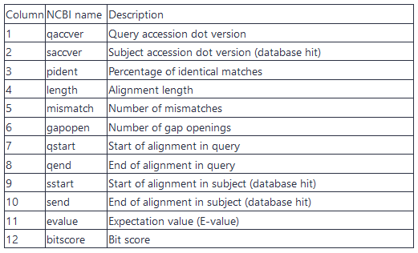
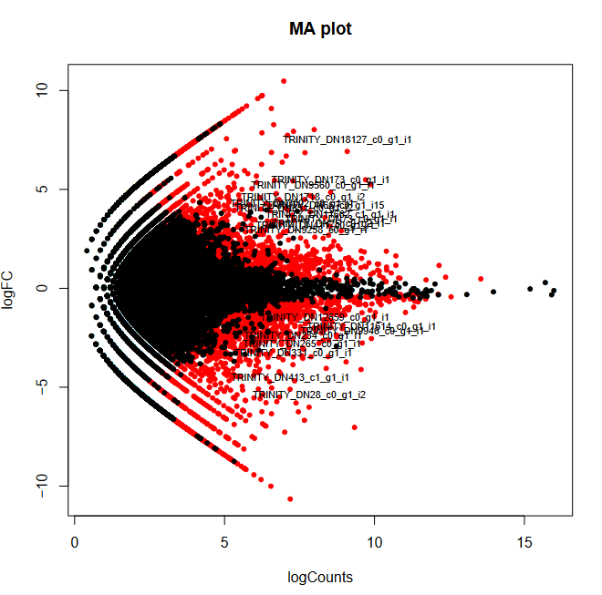
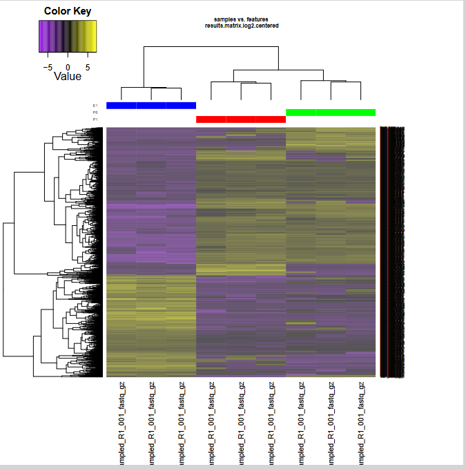

As a result of the development of novel sequencing technologies, the years between 2008 and 2012 saw a large drop in the cost of sequencing. Per megabase and genome, the cost dropped to 1/100,000th and 1/10,000th of the price, respectively. Prior to this, only transcriptomes of organisms that were of broad interest and utility to scientific research were sequenced; however, these developed in 2010s high-throughput sequencing (also called next-generation sequencing) technologies are both cost- and labor- effective, and the range of organisms studied via these methods is expanding.

Examining non-model organisms can provide novel insights into the mechanisms underlying the "diversity of fascinating morphological innovations" that have enabled the abundance of life on planet Earth. In animals and plants, the "innovations" that cannot be examined in common model organisms include mimicry, mutualism, parasitism, and asexual reproduction. De novo transcriptome assembly is often the preferred method to studying non-model organisms, since it is cheaper and easier than building a genome, and reference-based methods are not possible without an existing genome. The transcriptomes of these organisms can thus reveal novel proteins and their isoforms that are implicated in such unique biological phenomena.

[(source)](https://en.wikipedia.org/wiki/De_novo_transcriptome_assembly)

> ### Agenda
>
> In this tutorial, we will cover:
>
> 1. TOC
> {:toc}
>
{: .agenda}

# Get data (5 minutes)

In this tutorial, we will work with a real transcriptomic dataset from the free-living amoeba *Acanthamoeba castellanii*, an ubiquitous unicellular protozoan commonly found in artificial water systems such as plumbing and air conditioning units. This organism feeds on bacteria, viruses, and fungi via phagocytosis and acts as a vector for several pathogens, including *Legionella pneumophila*. Under stress, it enters a resistant cyst form.
**For convenience and to reduce processing time, each FASTQ file has been downsampled to 1 million sequences**.

The dataset, published by [Bernard et al. (2022)](https://www.nature.com/articles/s41467-022-31832-0), was generated to investigate early signalling pathways involved in the encystment process and to identify potential gene targets for its prevention. It includes 9 RNA-seq samples distributed across 3 experimental conditions:
- 3 replicates from culture medium at time 0 (**P0**)   
- 3 replicates from culture medium after 1 hour (**P1**)   
- 3 replicates from encystment medium after 1 hour (**E1**)   

   

> <hands-on-title>Data upload</hands-on-title>
>
> 1. **Create a new history for this tutorial**
>
>    
> 
> 2. **Import dataset from shared library 02_Formation_Transcriptomique_de_novo > 00_Raw_Data**
> 
>    
{: .hands_on}

# Format the dataset (5 minutes)

 For the next steps of the tutorial, we will need:
 - a dataset list containing all R1 and R2 files for each sample ; 
 - a dataset list containing only the R1 files ;
 - a dataset list containing only the R2 files.
 
 This step is specific to Galaxy’s dataset formatting requirements. It ensures that tools expecting paired-end files or separate R1/R2 inputs can process the data correctly without confusion.

> <hands-on-title>Data formatting</hands-on-title>
> 
> 1. **Build a dataset list named `RawData` containing all R1 and R2 files for each sample**
> 
>    
>
> 2. **Build a dataset list named `R1` containing only the R1 files**
> 
>    
> 
>    
> 
> 3. **Build a dataset list named `R2` containing only the R2 files**
> 
>    
> 
>    
> 
> 4. **Check that the datatype is `fastq.gz`**
>
>    
{: .hands_on}

# Quality control and read cleaning (30 minutes)

The first step in any sequencing data analysis is quality control.

This is crucial because various sources of bias can affect the quality of your data, such as:
- **Biological sampling** (e.g. contamination, low complexity)
- **Library preparation** (e.g. adapter/primer sequences, polyA/T tails)
- **Sequencing itself** (e.g. base-calling errors, optical duplicates, uneven coverage)

As a result, sequencing reads may contain:
- Unknown nucleotides (N)
- Low-quality bases
- Unwanted technical sequences
- Sequence composition biases (e.g. hexamer bias with Illumina)

Why correct these issues?
- To eliminate sequencing errors that can compromise downstream analyses
- Because most de Bruijn graph-based assemblers can't handle unknown or low-quality bases


## Quality control with **FastQC** and **MultiQC**
   
To get an overview of the sequencing data quality, we will use [**fastqc** (Simon Andrews, 2010) ](https://www.bioinformatics.babraham.ac.uk/projects/fastqc/) : *"fastqc provides a modular set of analyses which you can use to give a quick impression of whether your data has any problems of which you should be aware before doing any further analysis."* 
    

> <hands-on-title>Running FastQC</hands-on-title>
>
> 1. **FastQC**  with the following parameters:
>   - *"Short read data from your current history"*: `RawData` (collection) 
> 2. **Rename and tag output collections**
>    - *"FastQC on collection XX: RawData"* -> `FastQC_raw_data`
>    - *"FastQC on collection XX: Webpage"* -> `FastQC_raw_Webpage`
> 
> 
{: .hands_on}

> <question-title></question-title>
>
> What can you tell about the overall quality of the dataset ?
>
> > <solution-title></solution-title>
> >
> > Click on "*FastQC_raw_Webpage*" box in your history to see all the 18 QC reports.  
> > You can see that it's not convenient at all to check the reports one by one !   
> > Let's use a very useful tool in Bioinformatics : MultiQC.
> > 
> {: .solution}
{: .question}

> <comment-title></comment-title>
> For an exhaustive review of **fastqc** outputs, check out the [**"Quality control" tutorial**]().
{: .comment}


Now we can use [**MultiQC** (P. Ewels et al., 2016)](https://multiqc.info/) to aggregate all individual results in one summary page.

> <hands-on-title>Running MultiQC on FastqQC reports</hands-on-title>
>
> 1. **MultiQC**  with the following parameters:
>    - In *"Results"*:
>        - *"Which tool was used generate logs?"*: `FastQC`
>            - *"Type of FastQC output?"*: `Raw data`
>            - *"FastQC output"*: in dataset collections , select `FastQC_raw_data` 
>	 - *"Report title"*: `Training full-de-novo : raw QC` 
>	 - *"Use only flat plots (non-interactive images)"*: `No` 
>	 - *"Output the multiQC plots raw data?"*: `No`
>	 - *"Output the multiQC log file?"*: `No`
> 2. **Rename the output collection**
>    - *"MultiQC on data XX: Webpage"* -> `MultiQC_raw_Webpage`
>    - *"MultiQC on data XX: Stats"* -> `MultiQC_raw_Stats`
{: .hands_on}


> <question-title></question-title>
>
> 1. **Can you see the number of reads for each sample ? What do you notice ?**
> 2. **What is the general quality of the reads based on Phred scores ?**
> 3. **Is the base composition balanced across positions ?**
> 4. **Are there overrepresented sequences, and what is their likely origin ?**
> 5. **Is adapter contamination present? What should be done ?**
> 6. **Is the duplication level high, and is it problematic ?**
> 
> > <solution-title></solution-title>
> > 
> > 1. **Can you see the number of reads for each sample ? What do you notice ?**
> > *Open the MultiQC Webpage (click on the eye icon ). Under General Statistics section, click on "Configure columns" and check "Average Read Length" box.*
> > All samples have the same number of reads (1,000,000). This is normal here as the samples were downsampled. However, in real-world scenarios, differences can occur due to factors like library prep efficiency or biological variation, so it's common to see some variability in read counts.
> > 2. **What is the general quality of the reads based on Phred scores ?**
> > The Phred score (or quality score) is a measure of the confidence in the basecalling made by the sequencer. It reflects the probability that a base is called incorrectly.
> > It is logarithmically related to the error probability: Q=−10⋅log(P) where: Q = Phred score and P = probability of base call being incorrect.
> > A Phred score ≥ 40 is considered very high quality.
> > Overall, the quality is good. Most samples show a mean Phred score >30 across all positions, indicating reliable base calling with a low error probability (<0.1%). The quality remains stable throughout the read length, suggesting successful sequencing.
> > 3. **Is the base composition balanced across positions ?**
> > Yes, the base composition appears relatively balanced, especially in the early positions, which is expected for RNA-seq datasets. Some deviation may occur at the start due to hexamer priming or specific transcript content but nothing indicates strong bias or contamination.
> > 4. **Are there overrepresented sequences, and what is their likely origin ?**
> > Yes, several sequences are systematically overrepresented across all 18 samples. These include:
> > - Sequences like GATCGGAAGAG... → typical Illumina adapters
> > - Other consistent motifs likely related to primers or technical artifacts
> > These are most likely from library preparation artifacts (e.g. adapter dimers, priming sequences), not biological content.
> > 5. **Is adapter contamination present? What should be done ?**
> > Yes. The presence of known adapter sequences (e.g. Illumina TruSeq) is confirmed in the overrepresented sequence table.
> > Adapter trimming is needed!
> > 6. **Is the duplication level high, and is it problematic ?**
> > Here duplication levels range from ~28% to 35%, which is expected in RNA-seq due to:
> > - Highly expressed transcripts causing biological duplicates
> > - Lower complexity compared to WGS
> > - Possible PCR amplification biases
> > This does not necessarily indicate a problem in RNA-seq, unlike WGS. Interpretation depends on context. Here, levels are consistent and acceptable.
> >
> >
> {: .solution}
{: .question}

> <comment-title></comment-title>
> > For more guidance on interpreting quality metrics: [FastQC Documentation](https://www.bioinformatics.babraham.ac.uk/projects/fastqc/)
{: .comment}

 
## Sequencing error correction with **Rcorrector**  
  
To address the sequencing errors in the raw sequencing reads, we can use [**Rcorrector** (Song et al., 2015)](https://github.com/mourisl/Rcorrector) : *a kmer-based error correction method for RNA-seq data, based on the path search algorithm.*  

"Rcorrector scans the read sequence and, at each position, decides whether the next k-mer and each of its alternatives are solid and represent valid continuations of the path. The path with the smallest number of differences from the read sequence, representing the likely transcript of origin, is then used to correct k-mers in the original read."

   

Path extension in Rcorrector. Four possible path continuations at the AGTC k-mer (k=4) in the De Bruijn graph for the r=AAGTCATAA read sequence. Numbers in the vertices represent k-mer counts. The first (top) path corresponds to the original read’s representation in the De Bruijn graph. The extension is pruned after the first step, AGTC →GTCA, as the count M(GTCA)=4 falls below the local cutoff (determined based on the maximum k-mer count (494) of the four possible successors of AGTC). The second path (yellow) has higher k-mer counts but it introduces four corrections, changing the read into AAGTCCGTC. The third path (blue) introduces only two corrections, to change the sequence into AAGTCGTTA, and is therefore chosen to correct the read. The fourth (bottom) path is pruned as the k-mer count for GTCT does not pass the threshold. Paths 2 and 3 are likely to indicate paralogs and/or splice variants of this gene.   


> <hands-on-title>Running Rcorrector</hands-on-title>
>
> 1. **RNA-seq Rcorrector**  with the following parameters:
>    - *"Is this library paired- or single-end?"*: `paired`
>    - *"FastQ file R1 (left)"*:  `R1` (collection) 
>    - *"FastQ file R2 (left)"*:  `R2` (collection) 
>    - *"Filter uncorrectable reads*: `Yes` 
>    - *"Additional options*: `No`
> 2. Rename the output collections
>    - *"RNA-seq Rcorrector on collection XX: fixed R1"* -> `Fixed_R1`
>    - *"RNA-seq Rcorrector on collection XX: fixed R2"* -> `Fixed_R2`
{: .hands_on}

> <question-title></question-title>
>
>  Given that FastQC showed good quality reads, is the correction rate reported by Rcorrector consistent ?
>
> > <solution-title></solution-title>
> >
> > Click on `Fixed_R1` in your history, then select `P1-3_subsampled_R1_001.fastq.gz`, for example. 
> Click on the info icon , then open `Tool standard error` ('stderr') to view the run’s log file.  
> > At the end of the log, you’ll see something like:  
> > ```
> > Processed 2000000 reads  
> > Corrected 1351425 bases.
> > ```
> > 
> > Below is a table summarizing the results for all 9 samples:   
> > 
> > | Sample | Number of reads processed | Number of reads corrected | % of reads corrected |
> > |--------|----------------------------|----------------------------|----------------------|
> > | P1-3   | 2000000                    | 1351423                    | 0.450474333          |
> > | P1-2   | 2000000                    | 1350668                    | 0.450222667          |
> > | P1-1   | 2000000                    | 1365138                    | 0.455046             |
> > | P0-3   | 2000000                    | 1370210                    | 0.456736667          |
> > | P0-2   | 2000000                    | 1394060                    | 0.464686667          |
> > | P0-1   | 2000000                    | 1368961                    | 0.456320333          |
> > | E1-3   | 2000000                    | 1378207                    | 0.459402333          |
> > | E1-2   | 2000000                    | 1388749                    | 0.462916333          |
> > | E1-1   | 2000000                    | 1352088                    | 0.450696             |
> >
> > After running Rcorrector on the dataset, we observed that **approximately 0.45% of total bases were corrected in each sample**.
> > This low correction rate is consistent with the initial FastQC results, which indicated **high read quality**. 
> > Although minimal, these corrections can help reduce potential alignment errors and improve downstream quantification accuracy.
> {: .solution}
{: .question}

> <comment-title></comment-title>
> While Rcorrector remains a reliable tool for correcting Illumina RNA-seq reads, its use is no longer essential in most workflows. Modern RNA-seq data are typically of high quality. However, correction can still be useful when working with degraded RNA, non-model organisms, or low-quality data. In this tutorial, we include Rcorrector to demonstrate a complete preprocessing workflow.
{: .comment}

## rRNA removal with **Bowtie2**  
  
One of the main source of contamination of RNA-seq samples is **ribosomal RNA**. Indeed, ~90% of total RNA correspond to rRNA. Before sequencing, ribodepletion and polyA selection are common mmethods to clean the samples, but it does not filter out all rRNA. After sequencing, remove rRNA reads from raw reads and detect rRNA transcripts might be usefull.

To do so, we use [**Bowtie 2**](https://github.com/BenLangmead/bowtie2) which is an ultrafast and memory-efficient tool for aligning sequencing reads to reference sequences. 
Here, the reference database will be [**Silva**](https://www.arb-silva.de/): high quality ribosomal RNA database.

> <hands-on-title>Running Bowtie2 on Silva</hands-on-title>
> 1. **Bowtie2**  with the following parameters:
>    - *"Is this single or paired library"*: `Paired-end Dataset Collection`
>	 - *"FASTQ Paired Dataset"* : `fastq_raw_paired`  
>        - *"Write unaligned reads (in fastq format) to separate file(s)"*: `Yes`
>        - *"Write aligned reads (in fastq format) to separate file(s)"*: `No`
>        - *"Do you want to set paired-end options?"*: `No`
>    - *"Will you select a reference genome from your history or use a built-in index?"*: `Use a built-in genome index`
>        - *"Select reference genome"*: `SILVA LSU+SSU Reference sequence databank`
>    - *"Set read groups information?"*: `Do not set`
>    - *"Select analysis mode"*: `1:Default setting only`
>        - *"Do you want to use presets?"*: `Very sensitive end-to-end (--very-sensitive)`
>    - *"Do you want to tweak SAM/BAM Options?"*: `No`
>    - *"Save the bowtie2 mapping statistics to the history"*: `Yes`
> 2. **Rename the resulting datasets**
>    - `Bowtie2 on collection XX: unaligned reads (L)` -> `R1_filtered_reads` 
>    - `Bowtie2 on collection XX: unaligned reads (R)` -> `R2_filtered_reads`
>    - `Bowtie2 on collection XX: mapping stats` -> `filtered_reads_mapping_stats`
{: .hands_on}

> <comment-title></comment-title>
The --very-sensitive preset in Bowtie 2 modifies several internal parameters to increase alignment sensitivity. Specifically, it sets -D to 20 (more seed extension attempts), -R to 3 (more retries after failed alignments), and -L to 20 (shorter seed length for better sensitivity). It also adjusts the seed interval function -i to S,1,0.50, which places seeds closer together for more thorough searching. The mismatch allowance in the seed (-N) remains at 0. These changes make Bowtie 2 try harder to align difficult reads, improving accuracy at the cost of longer runtime.
{: .comment}


To analyze the mapping results, we will once again use MultiQC on Bowtie2 mapping stats files.

> <hands-on-title>Running MultiQC on Bowtie2 reports</hands-on-title>
>
> 1. **MultiQC**  with the following parameters:
>    - In *"Results"*:
>        - *"Which tool was used generate logs?"*: `Bowtie2`
>            - *"Output of Bowtie2"*: in dataset collections , select `filtered_reads_mapping_stats`
>	 - *"Report title"*: `Training full-de-novo : rRNA removal with Bowtie2` 
>	 - *"Use only flat plots (non-interactive images)"*: `No` 
>	 - *"Output the multiQC plots raw data?"*: `No`
>	 - *"Output the multiQC log file?"*: `No`
> 2. **Rename the output collection**
>    - *"MultiQC on data XX: Webpage"* -> `MultiQC_Bowtie2_Webpage`
>    - *"MultiQC on data XX: Stats"* -> `MultiQC_Bowtie2_Stats`
{: .hands_on}

> <question-title></question-title>
> 
> 1. What can you conclude from these Bowtie 2 mapping results against the SILVA rRNA database ?
> 2. Which files should you continue the analysis with ?   
>
> > <solution-title></solution-title>
> >
> > 1. Open the MultiQC Webpage (click on the eye icon ).
> > You should see:
> > 
> > | Sample Name  | % Aligned |
> > |-----------|-----------|
> > | E1-1      | 9.8%      |
> > | E1-2      | 8.8%      |
> > | E1-3      | 13.0%     |
> > | P0-1      | 9.6%      |
> > | P0-2      | 8.9%      |
> > | P0-3      | 14.9%     |
> > | P1-1      | 8.2%      |
> > | P1-2      | 13.2%     |
> > | P1-3      | 10.6%     |
> >
> > Mapping raw RNA-seq reads to the SILVA SSU and LSU databases using Bowtie 2 in --very-sensitive mode reveals that 8–15% of reads align to rRNA, indicating moderate contamination. This is typical for samples without rRNA depletion. The variability between samples may reflect biological or technical differences. These results justify removing rRNA-aligned reads to clean the dataset before transcriptomic analysis.
> > 
> > 2. We should discard all read mapping to rRNA sequences and continue the analysis with **unmapped** reads, `R1_filtered_reads` and `R2_filtered_reads`.
> {: .solution}
{: .question}

> <comment-title></comment-title>
>  Other filtering strategies can be used, like [**SortMeRNA** (Kopylova et al. 2012)](https://github.com/biocore/sortmerna), a tool developped to filter out rRNA from metatranscriptomic data. It is fast and it can discover new rRNA sequences.
>  There are also HMM-based tools such as [**RNAmmer** (Lagesen et al. 2007)](https://www.ncbi.nlm.nih.gov/pmc/articles/PMC1888812/) and [**Barrnap** (Seemann et al. 2013)](https://github.com/tseemann/barrnap), which predicts the location of ribosomal RNA genes in genomes.
{: .comment}

## Read cleaning with **Trimmomatic** 

   

> <hands-on-title>Task description</hands-on-title>
>
> 1. **Trimmomatic**  with the following parameters:
>    - *"Single-end or paired-end reads?"*: `Paired-end (two separate input files)`
>    - *"Input FASTQ file (R1/first of pair)"*: in dataset collections , select `R1_filtered_reads`
>    - *"Input FASTQ file (R2/first of pair)"*: in dataset collections , select `R2_filtered_reads`
>    - *"Perform initial ILLUMINACLIP step?"*: `Yes`
>    - *"Select standard adapter sequences or provide custom?"*: `Standard`
>        - "Adapter sequences to use": `TruSeq3 (additional seqs) (paired-ended, for MiSeq and HiSeq)`
>        - "Maximum mismatch count which will still allow a full match to be performed": `2`
>        - "How accurate the match between the two 'adapter ligated' reads must be for PE palindrome read alignment": `30`
>        - "How accurate the match between any adapter etc. sequence must be against a read": `10`
>        - "Minimum length of adapter that needs to be detected (PE specific/palindrome mode)": `8`
>        - "Always keep both reads (PE specific/palindrome mode)?": `Yes`
>    - In *"Trimmomatic Operation"*:
>        -  *"Insert Trimmomatic Operation"*
>            - *"Select Trimmomatic operation to perform"*: `Cut bases off end of a read, if below a threshold quality (TRAILING)`
>            - "Minimum quality required to keep a base": `3`
>        -  *"Insert Trimmomatic Operation"*
>            - *"Select Trimmomatic operation to perform"*: `Cut bases off start of a read, if below a threshold quality (LEADING)`
>            - "Minimum quality required to keep a base": `3`
>        -  *"Insert Trimmomatic Operation"*
>            - *"Select Trimmomatic operation to perform"*: `Sliding window trimming (SLIDINGWINDOW)`
>            - "Number of bases to average across": `4`
>            - "Average quality required": `20`
>        -  *"Insert Trimmomatic Operation"*
>            - *"Select Trimmomatic operation to perform"*: `Drop reads with average quality lower than a specific level (AVGQUAL)`
>                - *"Minimum average quality required to keep a read"*: `25`
>        -  *"Insert Trimmomatic Operation"*
>            - *"Select Trimmomatic operation to perform"*: `Drop reads below a specified length (MINLEN)`
>                - *"Minimum length of reads to be kept"*: `70`
> 2. **Rename** the Dataset Collection
>    - `Trimmomatic on collection XX and collection XX (R1 paired)` -> `R1_cleaned_reads`
>    - `Trimmomatic on collection XX and collection XX (R2 paired)` -> `R2_cleaned_reads`
>
>    > <comment-title></comment-title>
>    >
>    > You can check the Trimmomatic log files to get the number of reads before and after cleaning. 
     > To do so, click on the info icon , then click on *Tool Standard Output:stdout*
     > Example for P1-3:
>    > ```
>    > Input Read Pairs: 690897 
>    > Both Surviving: 604002 (87.42%) 
>    > Forward Only Surviving: 54227 (7.85%) 
>    > Reverse Only Surviving: 13515 (1.96%) 
>    > Dropped: 19153 (2.77%)
>    > ```
>    {: .comment}
>
>    
{: .hands_on}

## Quality control after cleaning

> <hands-on-title>Running FastQC on trimmed reads</hands-on-title>
>
> 1. **FastQC**  with the following parameters:
>   - *"Short read data from your current history"*: in dataset collections , select `R1_cleaned_reads` 
> 2. **Rename** outputs : 
>    - `FastQC on collection XX : Webpage` -> `FastQC_R1_cleaned_Webpage` 
>    - `FastQC on collection XX : RawData` -> `FastQC_R1_cleaned_Raw` 
> 3. **FastQC**  with the following parameters:
>   - *"Short read data from your current history"*: in dataset collections , select `R2_cleaned_reads` 
> 4. **Rename** outputs : 
>    - `FastQC on collection XX : Webpage` -> `FastQC_R2_cleaned_Webpage` 
>    - `FastQC on collection XX : RawData` -> `FastQC_R2_cleaned_Raw`
{: .hands_on}

> <hands-on-title>Running MultiQC on FastQC reports</hands-on-title>
>
> 1. **MultiQC**  with the following parameters:
>    - In *"Results"*:
>        - *"Which tool was used generate logs?"*: `FastQC`
>            - *"Type of FastQC output?"*: `Raw data`
>            - *"FastQC output"*: in dataset collections , select `FastQC_R1_cleaned_Raw`
>  - *"Report title"*: `Training full-de-novo : R1 cleaned QC` 
>  - *"Use only flat plots (non-interactive images)"*: `No` 
>  - *"Output the multiQC plots raw data?"*: `No`
>  - *"Output the multiQC log file?"*: `No`
> 2. **Rename and tag output collection**
>    - *"MultiQC on data XX: Webpage"* -> `MultiQC_R1_cleaned_Webpage`
>    - *"MultiQC on data XX: Stats"* -> `MultiQC_R1_cleaned_Stats`
>
> 3. **MultiQC**  with the following parameters:
>    - In *"Results"*:
>        - *"Which tool was used generate logs?"*: `FastQC`
>            - *"Type of FastQC output?"*: `Raw data`
>            - *"FastQC output"*: in dataset collections , select `FastQC_R2_cleaned_Raw`
>  - *"Report title"*: `Training full-de-novo : R2 cleaned QC` 
>  - *"Use only flat plots (non-interactive images)"*: `No` 
>  - *"Output the multiQC plots raw data?"*: `No`
>  - *"Output the multiQC log file?"*: `No`
> 4. **Rename and tag output collection**
>    - *"MultiQC on data XX: Webpage"* -> `MultiQC_R2_cleaned_Webpage`
>    - *"MultiQC on data XX: Stats"* -> `MultiQC_R2_cleaned_Stats`
{: .hands_on}

> <question-title></question-title>
> 
> 1. How can you check if adapters were successfully removed after trimming ?
> 2. What does it mean if adapter sequences are still detected after trimming ?
>
> > <solution-title></solution-title>
> >
> > 1. Open the MultiQC Webpage (click on the eye icon ).
> > Look at the "Adapter Content" section. You should see **"No samples found with any adapter contamination > 0.1%"**, meaning that adapter sequences were effectively removed and are no longer present at detectable levels in your trimmed data.
> > 2. It means that some adapters were not fully removed. This could happen if the wrong adapter sequences was set in the parameters. 
> > 
> {: .solution}
{: .question}

> <comment-title></comment-title>
While this tutorial uses Trimmomatic for read trimming, you can also try [Trim Galore](https://www.bioinformatics.babraham.ac.uk/projects/trim_galor) , a simpler alternative that combines Cutadapt and FastQC. It’s especially handy for quick and consistent adapter removal and quality filtering.
{: .comment}

# Assembly (120 minutes - computing)

To get to the transcripts information, we need to reconstruct all full-length transcripts from short reads. Such operation requires dedicated assemblers as the process of assembling a transcriptome violates many of the assumptions of genomic assemblers. For example, uniform coverage and the ‘one locus – one contig’ paradigm are not valid for RNA. An accurate transcriptome assembler will produce one contig per distinct transcript (isoform) rather than per locus, and different transcripts will have different coverage, reflecting their different expression levels.

> <comment-title></comment-title>
> Do you want to learn more about the principles behind assembly? Follow our [training](https://training.galaxyproject.org/training-material/topics/assembly/tutorials/debruijn-graph-assembly/slides.html).
{: .comment}


## Assembly with **Trinity**

We will use **Trinity**, a *de novo* transcriptome assembler for short sequencing reads.
**Trinity** is a widely used software for *de novo* transcriptome assembly from RNA-seq data, particularly when no reference genome is available. 
It reconstructs full-length transcripts by assembling short sequencing reads into **contigs**, leveraging the natural coverage and redundancy of RNA-seq. 
Trinity operates in three main steps: **Inchworm, Chrysalis, and Butterfly**, which together build and refine transcript structures. 
This tool is especially valuable for **studying non-model organisms, discovering novel transcripts, and analyzing alternative splicing**. 
Before running Trinity, **input reads should be high-quality and free of contaminants such as rRNA**, ensuring a more accurate and efficient assembly.


> <comment-title></comment-title>
> For detailed information on the Trinity assembler, please refer to the official [Trinity documentation.](https://github.com/trinityrnaseq/trinityrnaseq/wiki)
{: .comment}
> <hands-on-title>Running Trinity</hands-on-title>
>
> 1. **Trinity**  with the following parameters:
>    - *"Are you pooling sequence datasets?"*: `Yes`
>        - *"Paired or Single-end data?"*: `Paired-end`
>            - *"Left/Forward strand reads"*: in dataset collections , select `R1_cleaned_reads`
>            - *"Right/Reverse strand reads"*: in dataset collections , select `R2_cleaned_reads`
>            - *"Strand specific data"*: `No`
>            - *"Jaccard Clip options"*: `No`
>    - *"Run in silico normalization of reads"*: `No`
>    - In *"Additional Options"*:
>        - *"Use the genome guided mode?"*: `No`
> 2. **Rename** Trinity outputs
>    - `Trinity on data XX, data YY, and others: Assembled Transcripts` -> `transcriptome_raw.fasta`
>    - `Trinity on data XX, data YY, and others: Gene to transcripts map` -> `Gene_to_transcripts_map_raw`
>
>    
{: .hands_on}

> <question-title></question-title>
>
> 2. How are named the transcripts by Trinity in `transcriptome_raw.fasta` assembly ? What does it mean ?
> 1. What is the file `Gene_to_transcripts_map_raw` ?
>
> > <solution-title></solution-title>
> >
> > 1. Trinity groups transcripts into clusters based on shared sequence content. Such a transcript cluster is very loosely referred to as a 'gene'. This information is encoded in the Trinity fasta accession. The accession encodes the Trinity 'gene' and 'isoform' information. For example, the accession 'TRINITY_DN1000_c115_g5_i1' indicates Trinity read cluster 'TRINITY_DN1000_c115', gene 'g5', and isoform 'i1'. The Path information stored in the header ("path=[31015:0-148 23018:149-246]") indicates the path traversed in the Trinity compacted de Bruijn graph to construct that transcript. 
> > 
> > 2. A Trinity gene is a collection of related transcripts. This file lists genes and related isoforms.
> > [Learn more about Trinity output.](https://github.com/trinityrnaseq/trinityrnaseq/wiki/Output-of-Trinity-Assembly)
> > 
> {: .solution}
{: .question}

> <comment-title></comment-title>
> [rnaSPAdes](https://gensoft.pasteur.fr/docs/SPAdes/3.14.0/rnaspades_manual.html) is a more recent de novo transcriptome assembler developed as part of the SPAdes toolkit. It is specifically designed for RNA-seq data and offers an alternative to assemblers like Trinity.
> Trinity and rnaSPAdes are both de novo transcriptome assemblers designed for RNA-seq data, but they differ in architecture and approach. 
> Trinity uses a three-module pipeline (Inchworm, Chrysalis, Butterfly) to build and explore de Bruijn graphs per component, aiming to reconstruct full-length transcripts and isoforms. 
> In contrast, rnaSPAdes employs an integrated de Bruijn graph framework with built-in error correction, expression-guided path selection, and redundancy reduction. 
> While Trinity is known for its sensitivity and widespread use, it can produce more redundant assemblies and is often more resource-intensive. 
> rnaSPAdes, being newer, tends to generate more compact assemblies and is generally faster and lighter on computational resources, though results may vary depending on the dataset.
{: .comment}

> <comment-title></comment-title>
> [De novo transcriptome assembly: A comprehensive cross-species comparison of short-read RNA-Seq assemblers](https://academic.oup.com/gigascience/article/8/5/giz039/5488105)
{: .comment}

# Assembly assessment / cleaning (120 minutes)

The *de novo* transcriptome assembly needs to be evaluated before any further downstream analyses in order to check if it reaches sufficient quality criteria. We generally use 3 criteria to perform such analysis:
- **Completeness** according to conserved ortholog content.
- **RNA-Seq read representation of the assembly** (i.e. coverage) to ensure that reads used for the assembly are mapped back to the assembled transcriptome.
- **Contiguity/metrics** such as the number of transcripts, isoforms, the N50, etc.


## Transcriptome annotation completeness with **Busco**

[BUSCO (Benchmarking Universal Single-Copy Orthologs)](https://busco.ezlab.org/) is a widely used tool for evaluating the completeness of genome, transcriptome, or proteome assemblies. It allows a measure for quantitative assessment of genome/transcriptome/proteome completeness based on evolutionarily informed expectations of gene content. When applied to a raw transcriptome assembly—such as one produced by Trinity from RNA-seq reads of Acanthamoeba castellanii—BUSCO searches for conserved single-copy orthologs using a relevant database, in this case eukaryota_odb10, which contains genes expected to be present across most eukaryotic species. Since A. castellanii is a eukaryote belonging to the Amoebozoa clade, this database is appropriate. A high proportion of complete BUSCOs (either single-copy or duplicated) reflects a high-quality and comprehensive transcriptome assembly. Conversely, a larger number of fragmented or missing BUSCOs may indicate incomplete assembly, poor read coverage, or biological factors such as gene loss or divergence.

> <hands-on-title>Running Busco</hands-on-title>
>
> 1. **Busco**  with the following parameters:
>    - *"Sequence to analyse"*: `transcriptome_raw.fasta`
>    - *"Mode"*: `transcriptome`
>    - *"Lineage"*: `eukaryota_odb10`
> 2. **Rename** the outputs
>    - `Busco on data XX: short summary` -> `Busco_raw_short_summary`
>    - `Busco on data XX: full table` -> `Busco_raw_full_table`
>    - `Busco on data XX: missing buscos` -> `Busco_raw_missing_buscos`
{: .hands_on}


> <question-title></question-title>
>
>  What can you say about the transcriptome completeness ?
>
> > <solution-title></solution-title>
> >
> >  You can click on the visualisation icon  of the short summary :
> > ```
> > ***** Results: *****
> >  C:85.8%[S:72.9%,D:12.9%],F:7.1%,M:7.1%,n:255	   
> >  	219	Complete BUSCOs (C)			   
> >  	186	Complete and single-copy BUSCOs (S)	   
> >  	33	Complete and duplicated BUSCOs (D)	   
> >  	18	Fragmented BUSCOs (F)			   
> >  	18	Missing BUSCOs (M)			   
> >  	255	Total BUSCO groups searched		      
> > ```
> > The BUSCO analysis performed on the raw transcriptome assembly of Acanthamoeba castellanii, using the eukaryota_odb10 lineage dataset (255 BUSCO groups), revealed a completeness score of 85.8%. Out of the total BUSCOs searched, 72.9% were identified as complete and single-copy, while 12.9% were complete but duplicated, suggesting either biological redundancy (e.g., isoforms or gene duplications) or assembly artifacts resulting from the de novo process. Additionally, 7.1% of BUSCOs were fragmented, and another 7.1% were completely missing, which remains within acceptable thresholds for a transcriptome assembled without a reference genome. Overall, these results indicate that the assembly captures the majority of conserved eukaryotic genes, providing a solid basis for downstream analyses, despite some redundancy and incompleteness inherent to transcriptome reconstruction from RNA-seq data.
> >
> {: .solution}
{: .question}

<!--## Checking assembly statistics

**Trinity Statistics*** displays the summary statistics for a fasta file.

> <hands-on-title>Task description</hands-on-title>
>
> 1. **Trinity Statistics**  with the following parameters:
>    - *"Trinity assembly"*: `transcriptome_raw.fasta`
>
>    > <comment-title></comment-title>
>    > This step, even with this toy dataset, will take around 2 hours
>    {: .comment}
>
{: .hands_on}

> ###  Questions
>
> 1. TODO
>
> > ###  Solution
> >
> > 1. TODO
> >
> {: .solution}
>
{: .question}
-->

## Remapping reads on raw transcriptome

Remapping reads back to assembly aims to examine the RNA-Seq read representation of the assembly.

Several methods are available for estimating transcript abundance, including alignment-based methods 
(aligning reads to the transcript assembly) and alignment-free methods 
(examining k-mer abundances in the reads and in the resulting assembly).
Alignment-free methods such as Kallisto and Salmon are way more faster than alignment-based quantification methods.
In return, they cannot provide alignment files (BAM), only a coverage table.

Ideally, at least ~80% of input RNA-Seq reads are represented by the transcriptome assembly.
The remaining unassembled reads likely corresponds to lowly expressed transcripts with insufficient coverage to enable 
assembly, to low quality or aberrant reads.

> <hands-on-title>Using Trinity "Align reads and estimate abundance" wrapper</hands-on-title>
>
> 1. **Align reads and estimate abundance**  with the following parameters:
>    - *"Transcripts"*: `transcriptome_raw.fasta`
>    - *"Gene to Transcripts map"*: `Gene_to_transcripts_map_raw`
>    - *"Paired or Single-end data?"*: `Paired`
>        - *"Left/Forward strand reads"* -> in dataset collections , select `R1_cleaned_reads`
>        - *"Right/Reverse strand reads"* -> in dataset collections , select `R2_cleaned_reads`
>        - *"Strand specific data"*: `No`
>        - *"Maximum insert size"*: `800`
>    - *"Abundance estimation method"*: `RSEM`
>    - *"Alignment method"*: `Bowtie2`
>    - In *"Additional Options"*:
>        - *"Trinity assembly?"*: `Yes`
> 2. **Rename** output collection 
>    -  `Align reads and estimate abundance on collection XX: genes counts` -> `genes_counts_raw`
>    -  `Align reads and estimate abundance on collection XX: isoforms counts` -> `isoforms_counts_raw`
>
>
>    > <comment-title></comment-title>
>    >
>    > At this stage, you can now delete some useless datasets
>    > - `Trimmomatic on collection XX: unpaired`
>    > - `Align reads and estimate abundance on *: genes counts`
>    > - ...
>    > Note that the dataset are just hidden. You can delete them permanently and make some room in the history options 
>    {: .comment}
{: .hands_on}

> <question-title></question-title>
>
>  What are the mapping rates of the trimmed RNA-seq reads mapped back to the *de novo* assembled transcriptome, and what does this tell us about the quality of the assembly ?
>
> > <solution-title></solution-title>
> >
> > If you check at the Standard Error messages of your outputs, you can get the `Mapping rate`
>    > 1. Click on one dataset
>    > 2. Click on the little  
>    > 3. Click on *Tool Standard Error:	stderr*
> > Example for sample P1-3 :   
> > ```
> > 604002 reads; of these:
> >   604002 (100.00%) were paired; of these:
> >     64776 (10.72%) aligned concordantly 0 times
> >     382907 (63.39%) aligned concordantly exactly 1 time
> >     156319 (25.88%) aligned concordantly >1 times
> > 89.28% overall alignment rate
> > ```
> > 
> > Below is a table summarizing the results for all 9 samples:
> > 
> >  | Sample | Total Reads | Overall Alignment Rate | 0× Aligned (%) | 1× Aligned (%) | >1× Aligned (%) |
> >  |--------|-------------|------------------------|----------------|----------------|------------------|
> >  | P1-3   | 604,002     | 89.28%                 | 10.72%         | 63.39%         | 25.88%           |
> >  | P1-2   | 595,892     | 88.88%                 | 11.12%         | 61.78%         | 27.10%           |
> >  | P1-1   | 615,491     | 89.51%                 | 10.49%         | 65.62%         | 23.89%           |
> >  | P0-3   | 593,254     | 89.68%                 | 10.32%         | 62.80%         | 26.89%           |
> >  | P0-2   | 611,204     | 88.65%                 | 11.35%         | 62.50%         | 26.15%           |
> >  | P0-1   | 594,172     | 88.88%                 | 11.12%         | 65.00%         | 23.88%           |
> >  | E1-3   | 596,083     | 88.46%                 | 11.54%         | 59.92%         | 28.53%           |
> >  | E1-2   | 612,196     | 89.24%                 | 10.76%         | 61.92%         | 27.32%           |
> >  | E1-1   | 599,683     | 88.43%                 | 11.57%         | 61.79%         | 26.63%           |
> > 
> > The alignment statistics indicate that 88–90% of trimmed RNA-seq reads map back to the de novo assembled transcriptome, suggesting a high-quality assembly that captures most expressed transcripts. About 60–66% of reads align uniquely, reflecting good transcript specificity, while 23–28% align multiple times, likely due to isoforms or duplicated sequences. Only ~10–11% fail to align, pointing to minor gaps, low expression, or noise. Overall, the results support a comprehensive and biologically representative assembly, with expected redundancy due to transcriptomic complexity.
> > 
> {: .solution}
{: .question}

## Merge the mapping tables and compute normalizations

This step will combine abundance estimations (produced by 'Align reads and estimate abundance' step) from multiple samples into a single tabular file. 
This matrix can then be used by 'RNASeq samples quality check for transcript quantification' and 'Differential Expression Analysis using a Trinity assembly' tools.

> <hands-on-title>Using Trinity "Build expression matrix" wrapper</hands-on-title>
>
> 1. **Build expression matrix**  with the following parameters:
>    - *"Abundance estimates"*: in dataset collections , select `isoforms_counts_raw`
>    - *"Gene to transcript correspondance"*: `Gene_to_transcripts_map_raw`
>    - *"Abundance estimation method"*: `RSEM`
> 2. **Rename outputs**
>    - `Build expression matrix on data XX: matrix of isoform TMM-normalized expression values` -> `TMM-normalized_isoform_matrix`
>    - `Build expression matrix on data XX: matrix of isoform TPM expression values (not cross-sample normalized)` -> `TPM-NON-normalized_isoform_matrix`
{: .hands_on}

> <question-title></question-title>
>
> What are the specific expression matrix files generated ?
>
> > <solution-title></solution-title>
> >
> > This tool outputs 6 expression matrices at both the gene and isoform levels. Here's what each output represents: 
> > 
> > *Gene-level matrices* :
> > - Raw gene counts: estimated number of RNA-Seq fragments mapped to each gene (estimated RNA-Seq fragment gene counts).
> > - Gene TPM values (not normalized across samples): Transcript-Per-Million values per gene.
> > - Gene TMM-normalized values: TPM values normalized using TMM across samples for between-sample comparisons (e.g. PCA, heatmaps, clustering).
> > 
> > *Isoform-level matrices* :
> > - Raw isoform counts: estimated reads/fragments per individual isoform (estimated RNA-Seq fragment isoform counts).
> > - Isoform TPM values (not normalized across samples): Transcript-Per-Million values per isoform.
> > - Isoform TMM-normalized values: adjusted isoform-level TPM values normalized using TMM across samples for between-sample comparisons (e.g. PCA, heatmaps, clustering).
> >
> {: .solution}
{: .question}

## Compute contig Ex90N50 statistic and Ex90 transcript count

The N50 statistic is a common metric used in genome and transcriptome assemblies to assess contiguity. It represents the length N such that 50% of the total assembled sequence length is contained in contigs (or transcripts) of length N or longer.
In other words, when you sort all contigs by length from longest to shortest, the N50 is the length at which the cumulative sum reaches half of the total assembly size.

An alternative metric, more appropriate for transcriptome assemblies, is the ExN50 statistic.

Unlike the traditional N50, the ExN50 focuses on the most highly expressed transcripts. Specifically, it calculates the N50 value but only considering transcripts that cumulatively account for x% of the total normalized expression data (e.g., TPM).

Gene expression is computed as the sum of expression levels of all its transcript isoforms, and gene length is estimated as the expression-weighted average of isoform lengths.

For example, Ex90N50 is the N50 calculated using only the top expressed transcripts that together make up 90% of the total expression, providing a measure of assembly contiguity weighted by transcript abundance.

> <hands-on-title>Using Trinity "Compute contig Ex90N50 statistic and Ex90 transcript count" wrapper</hands-on-title>
>
> 1. **Compute contig Ex90N50 statistic and Ex90 transcript count**  with the following parameters:
>    - *"Expression matrix"*: `TMM-normalized_isoform_matrix`
>    - *"Transcripts"*: `transcriptome_raw.fasta`
{: .hands_on}

**What we get:**


The ExN50 plot shows that contig length (N50) increases with transcript expression levels, peaking around Ex90 with values near 1800–1900 bp. This indicates that the most highly expressed transcripts are well assembled, a typical pattern for high-quality de novo transcriptome assemblies. The sharp fluctuations at lower expression levels reflect variability in low-abundance transcripts, which are more difficult to assemble reliably. Overall, the plot supports the effectiveness of Trinity in reconstructing the majority of the transcriptome, especially the most biologically relevant, highly expressed transcripts.

> <comment-title></comment-title>
> To learn more about Ex90N50 plots, check [Transcriptome-Contig-Nx-and-ExN50-stats page.](https://github.com/trinityrnaseq/trinityrnaseq/wiki/Transcriptome-Contig-Nx-and-ExN50-stats)
{: .comment}


> <comment-title></comment-title>
> Other tools have been developped such as [**DETONATE** (Li et al. 2014)](https://github.com/deweylab/detonate), [**TransRate** (Smith-Una et al. 2016)](https://hibberdlab.com/transrate/) or [**rnaQUAST** (Bushmanova et al. 2016)](https://github.com/ablab/rnaquast) to evaluate transcriptome assembly quality.
{: .comment}

## Replicates quality assessment

This tool performs quality checks on an RNA-Seq experiment by analyzing abundance estimates across different samples, using a transcriptome assembled with Trinity.
It's good to examine the data to ensure that biological replicates are well correlated, and also to investigate relationships among samples.

If there are any obvious discrepancies among sample and replicate relationships such as due to accidental 
mis-labeling of sample replicates, or strong outliers or batch effects, we want to identify them before 
proceeding to subsequent data analyses (such as differential expression).

The first step is to create a data frame describing the samples and specifying their corresponding experimental conditions.

> <hands-on-title>Using "Describe samples and replicates"</hands-on-title>
> 1. **Get exact sample names as writen in the expression matrix**
>    - Open the `TMM-normalized_isoform_matrix` : click on the eye icon 
>    - Copy the sample names: P1-3_subsampled_R1_001_fastq_gz ; P1-2_subsampled_R1_001_fastq_gz ; P1-1_subsampled_R1_001_fastq_gz ; P0-3_subsampled_R1_001_fastq_gz ; P0-2_subsampled_R1_001_fastq_gz ; P0-1_subsampled_R1_001_fastq_gz ; E1-3_subsampled_R1_001_fastq_gz ; E1-2_subsampled_R1_001_fastq_gz ; E1-1_subsampled_R1_001_fastq_gz
> 2. **Describe samples and replicates**  with the following parameters:
>    -  Insert samples 
>      - *"Full sample name"*: `P1-1_subsampled_R1_001_fastq_gz`
>      - *"Condition"*: `P1`
>    -  Insert samples 
>      - *"Full sample name"*: `P1-2_subsampled_R1_001_fastq_gz`
>      - *"Condition"*: `P1`
>    -  Insert samples 
>      - *"Full sample name"*: `P1-3_subsampled_R1_001_fastq_gz`
>      - *"Condition"*: `P1`
>    -  Insert samples 
>      - *"Full sample name"*: `P0-1_subsampled_R1_001_fastq_gz`
>      - *"Condition"*: `P0`
>    -  Insert samples 
>      - *"Full sample name"*: `P0-2_subsampled_R1_001_fastq_gz`
>      - *"Condition"*: `P0`
>    -  Insert samples 
>      - *"Full sample name"*: `P0-3_subsampled_R1_001_fastq_gz`
>      - *"Condition"*: `P0`
>    -  Insert samples 
>      - *"Full sample name"*: `E1-1_subsampled_R1_001_fastq_gz`
>      - *"Condition"*: `E1`
>    -  Insert samples 
>      - *"Full sample name"*: `E1-2_subsampled_R1_001_fastq_gz`
>      - *"Condition"*: `E1`
>    -  Insert samples 
>      - *"Full sample name"*: `E1-3_subsampled_R1_001_fastq_gz`
>      - *"Condition"*: `E1`
> 3. **Rename outputs**
>     - `XX: Describe samples` -> `samples_description`
{: .hands_on}
**What we get:**

>    
> <hands-on-title>Using "RNASeq samples quality check for transcripts quantification"</hands-on-title>
>
> 1. **NASeq samples quality check for transcripts quantification**  with the following parameters:
>    - *"Expression matrix"*: `TMM-normalized_isoform_matrix`
>    - *"Samples description"*: `samples_description`
{: .hands_on}
**What we get:**
The tool outputs here 5 files, among which:
- **Replicate Pearson correlation heatmap** : `input.matrix.CPM.log2.sample_cor_matrix.pdf` The heatmap gives an overview of similarities and dissimilarities between samples: the color represents the distance between the samples.

About the Heatmap:
   - Samples cluster tightly within their respective experimental groups (P0, P1, E1).
   - No clear outliers were detected.
   - The hierarchical clustering confirms distinct separation between the experimental conditions.

- **Principal Component Analysis (PCA)** : `input.matrix.CPM.log2.prcomp.principal_components.pdf`.  It shows the samples in the 2D plane spanned by their first two principal components. Each replicate is plotted as an individual data point. This type of plot is useful for visualizing the overall effect of experimental covariates and batch effects.

About the PCA:
   - PC1 explains the majority of the variance (79.81%) and clearly separates E1 from the other groups. 
   - PC2 and PC3 further distinguish P1 from P0. 
   - Replicates cluster closely, showing sample consistency and proper grouping.

Conclusion:
The quality control results indicate high consistency within replicates and clear biological separation between conditions.

## Filter low expression transcripts

Most downstream analyses should be applied to the entire set of assembled transcripts, including functional annotation and differential expression analysis.
If you do decide that you want to filter transcripts to exclude those that are lowly expressed, you can use the following step.

Be cautious in filtering transcripts solely based on expression values, as you can easily discard biologically relevant transcripts from your data.
Ideally, any filtering would consider a combination of expression values and functional annotation data, and filtering is currently 
more of an art than a science, and again, simply not needed in most circumstances unless you have a very clear objective in doing so.

> <hands-on-title>Using Trinity "Filter low expression transcripts" wrapper</hands-on-title>
>
> 1. **Filter low expression transcripts**  with the following parameters:
>    - *"Trinity assembly"*: `transcriptome_raw.fasta`
>    - *"Expression matrix"*: `TPM-NON-normalized_isoform_matrix`
>    - *"Minimum expression level required across any sample"*: `1.0`
>    - *"Isoform filtering method"*: `Keep all isoforms above a minimum percent of dominant expression`
>        - *"Minimum percent of dominant isoform expression"*: `1`
>
>    > <comment-title></comment-title>
>    >
>    > If you check at the Standard Error messages of your outputs. You can get the `Retained` rate
>    > 1. Click on one dataset
>    > 2. Click on the little 
>    > 3. Click on *Tool Standard Error:	stderr*
>    > At the end of the file you should see:
>    > ```
>    > 	Retained 28485 / 28724 = 99.17% of total transcripts.
>    > ```
>    {: .comment}
>
> 2. **Rename** the output
>    - `Filter low expression transcripts on data XX: filtered low expression transcripts` -> `transcriptome_filtered.fasta`
{: .hands_on}

We now need to generate a new gene-to-transcript mapping file for the filtered transcriptome, as the original one was generated by Trinity during the raw assembly.
> <hands-on-title>Running Trinity "Generate gene to transcript map" wrapper</hands-on-title>
>
> 1. **Generate gene to transcript map**  with the following parameters:
>    - *"Trinity assembly"*: `transcriptome_filtered.fasta`
> 2. **Rename** output:
>    - `Generate Gene to transcripts map on data XX` : `Gene_to_transcripts_map_filtered`
{: .hands_on}

<!--## Checking of the assembly statistics after cleaning

> <hands-on-title>Task description</hands-on-title>
>
> 1. **Trinity Statistics**  with the following parameters:
>    - *"Trinity assembly"*: `transcriptome_filtered.fasta`
>
{: .hands_on}

> ###  Questions
>
> 1. TODO
>
> > ###  Solution
> >
> > 1. TODO
> >
> {: .solution}
>
{: .question}
-->

# Annotation (120 minutes)

To get a robust transcriptome annotation, it is important to annotate the assembled transcripts and derived putative proteins as well.  
To do so, we will first predict coding regions then perform similarity search on UniprotKB/SwissProt. Then, we can search more precisely for transmembrane domains and protein profiles to refine the annotation. Finally, the results from previous steps can be summarized using Trinotate.

## Peptide prediction with **TransDecoder**

[TransDecoder](https://github.com/TransDecoder/TransDecoder/releases) identifies candidate coding regions within transcript sequences generated by Trinity. TransDecoder identifies candidate protein-coding regions based on nucleotide composition, open reading frame (ORF) length, and (optional) Pfam domain content.

TransDecoder identifies likely coding sequences based on the following criteria:
- an open reading frame (ORF) is found in a transcript sequence with length greater than threshold (usually 100)
- a log-likelihood score similar to what is computed by the GeneID software is > 0.
- the above coding score is greatest when the ORF is scored in the 1st reading frame as compared to scores in the other 5 reading frames.
- if a candidate ORF is found fully encapsulated by the coordinates of another candidate ORF, the longest one is reported. However, a single transcript can report multiple ORFs (allowing for operons, chimeras, etc).
- optional : the putative peptide has a match to a Pfam domain above the noise cutoff score.

> <hands-on-title>Running TransDecoder</hands-on-title>
>
> 1. **TransDecoder**  with the following parameters:
>    - *"Transcripts"*: `transcriptome_filtered.fasta`
>    - *"Minimum protein length"*: `100`
>    - In *"Training Options"*:
>        - *"Select the training method"* : `Train with the top longest ORFs`
>        - *"Number of top longest ORFs"* : `500`
> 2. **Rename outputs**
>    - `TransDecoder on data XXX: gff3` -> `TransDecoder_predicted_features_gff3`
>    - `TransDecoder on data XXX: bed` -> `TransDecoder_predicted_bed`
>    - `TransDecoder on data XXX: cds` -> `TransDecoder_predicted_cds`
>    - `TransDecoder on data XXX: pep` -> `TransDecoder_predicted_proteins`
{: .hands_on}

> <question-title></question-title>
>
> What are the 4 generated files ?
> 
> > <solution-title></solution-title>
> >
> > **gff3** : a file to describe the predicted features in the transcriptome (`gene`, `mRNA`, `exon`,`CDS`,`3'UTR`,`5'UTR`)   
> > **bed** : feature coordinates file  
> > **cds** : sequence file, containing CDS (Coding DNA Sequences)  
> > **pep** : the most important file, which contains the protein sequences corresponding to the predicted coding regions within the transcripts.  
> > 
> {: .solution}
{: .question}

## Similarity search with **BLAST**


[**The Basic Local Alignment Search Tool (BLAST)**](https://blast.ncbi.nlm.nih.gov/Blast.cgi) finds regions of similarity between sequences. The program compares nucleotide or protein sequences and calculates the statistical significance of matches. BLAST can be used to infer functional and evolutionary relationships between sequences as well as help identify members of gene families.  
  
There are several types of BLAST searches, including:  
    - **BLASTp** (Protein BLAST): compares one or more protein query sequences to a subject protein sequence or a database of protein sequences. This is useful when trying to identify a protein.  
    - **BLASTx** (translated nucleotide sequence searched against protein sequences): compares a nucleotide query sequence that is translated in six reading frames (resulting in six protein sequences) against a database of protein sequences. Because blastx translates the query sequence in all six reading frames and provides combined significance statistics for hits to different frames, it is particularly useful when the reading frame of the query sequence is unknown or it contains errors that may lead to frame shifts or other coding errors. Thus blastx is often the first analysis performed with a newly determined nucleotide sequence. [Learn more about BLAST](https://guides.lib.berkeley.edu/ncbi/blast)  
    
Here, we will use **BLASTp** to search for similarities between the `.pep` protein sequences produces by TransDecoder and the proteins reported in the highly curated database [UniProtKB/SwissProt](https://www.uniprot.org/help/uniprotkb) (one record per gene in one species). Then we will use **BLASTx** to search for similarities between the filtered transcriptome nucleotide and [UniProtKB/SwissProt](https://www.uniprot.org/help/uniprotkb).  

> <hands-on-title>Running BLAST</hands-on-title>
>
> 1. **NCBI BLAST+ blastp**  with the following parameters:
>    - *"Protein query sequence(s)"*: `TransDecoder_predicted_proteins`
>    - *"Subject database/sequences"*: `Locally installed general BLAST database`
>    - *"Protein BLAST database"*: `UniprotKB/Swissprot databank`
>    - *"Type of BLAST"*: `Traditional BLASTP`
>    - *"Set expectation value cutoff"*: `0.001`
>    - *"Output format"*: `Tabular (extended 25 columns)`
> 2. **NCBI BLAST+ blastx**  with the following parameters:
>    - *"Nucleotide query sequence(s)"*: `transcriptome_filtered.fasta`
>    - *"Subject database/sequences"*: `Locally installed general BLAST database`
>    - *"Protein BLAST database"*: `UniprotKB/Swissprot databank`
>    - *"Query genetic code"*: `Standard`
>    - *"Type of BLAST"*: `Traditional BLASTX`
>    - *"Set expectation value cutoff"*: `0.001`
>    - *"Output format"*: `Tabular (extended 25 columns)`
> 3. **Rename** the BLASTP output
>    - `blastp on data XXX` -> `blastp`
> 4. **Rename** the BLASTX output
>    - `blastx on data XXX` -> `blastx`
{: .hands_on}

> <comment-title></comment-title>
> UniProtKB/Swiss-Prot is the manually curated section of the UniProt database, providing high-quality, reviewed protein sequences with detailed functional annotations. It offers accurate and reliable information, making it a key resource for protein research.
{: .comment}

> <question-title></question-title>
>
> What are the different columns in the resulting tab ?
>
> > <solution-title></solution-title>
> >
> >  
> >  
> > 
> {: .solution}
{: .question}
<!--
## Find signal peptides

> <hands-on-title>Task description</hands-on-title>
>
> 1. **SignalP 3.0**  with the following parameters:
>    - *"Fasta file of protein sequences"*: `TransDecoder on data XXX: pep`
>
{: .hands_on}
-->

## Find transmembrane domains with **TMHMM**

[**TMHMM** (Krogh et al, 2001)](https://services.healthtech.dtu.dk/service.php?TMHMM-2.0) predicts transmembrane helices from single sequence based on a hidden Markov model. The prediction gives the most probable location and orientation of transmembrane helices in the sequence. It is found by an algorithm called N-best (or 1-best in this case) that sums over all paths through the model with the same location and direction of the helices. 

> <hands-on-title>Running TMHMM 2.0</hands-on-title>
>
> 1. **TMHMM 2.0**  with the following parameters:
>    - *"FASTA file of protein sequences"*: `TransDecoder_predicted_proteins` 
{: .hands_on}

> <question-title></question-title>
>
> 1. What are the different columns in the resulting tab ?
> 2. What does a Topology of `i` and `o` mean ?
>
> > <solution-title></solution-title>
> >
> > 1. Each line starts with the sequence identifier and then these fields:  
> >    - `len`: the length of the protein sequence.  
> >    - `ExpAA`: The expected number of amino acids intransmembrane helices (see above).  
> >    - `First60`: The expected number of amino acids in transmembrane helices in the first 60 amino acids of the protein (see above).  
> >    - `PredHel`: The number of predicted transmembrane helices by N-best.  
> >    - `Topology` : The topology predicted by N-best.  
> > For example :  
> >    `TRINITY_DN104_c0_g1::TRINITY_DN104_c0_g1_i1::g.114::m.114	110	39.10	17.86	2	i43-60o65-87i`  
> > -> The topology is given as the position of the transmembrane helices separated by 'i' if the loop is on the inside or 'o' if it is on the outside. The above example 'i43-60o65-87i' means that it starts on the inside, has a predicted TMH at position 43 to 60, the outside, then a TMH at position 64-87 etc.  
> > 2. If the whole sequence is labeled as inside (i) or outside (o), the prediction is that it contains no membrane helices.  
> > 
> {: .solution}
{: .question}

## Search again profile database with **HMMscan** (HMMER)

[**HMMER (Finn et al, 2015)**](https://hmmer-web-docs.readthedocs.io/en/latest/about.html) is used to search sequence databases for sequence homologs, and to make sequence alignments. It implements methods using probabilistic models called profile hidden Markov models(profile HMMs).  

Here, we will use HMMscan to search homologs of the predicted coding regions in the transcripts (`.pep` file from TransDecoder) in [**Pfam**](https://pfam.xfam.org/) database.  

The Pfam database is a large collection of protein families, each represented by multiple sequence alignments and hidden Markov models (HMMs). 
Proteins are generally composed of one or more functional regions, commonly termed domains. Different combinations of domains give rise to the diverse range of proteins found in nature. The identification of domains that occur within proteins can therefore provide insights into their function.
Pfam also generates higher-level groupings of related entries, known as clans. A clan is a collection of Pfam entries which are related by similarity of sequence, structure or profile-HMM.
The data presented for each entry is based on the UniProt Reference Proteomes but information on individual UniProtKB sequences can still be found by entering the protein accession. Pfam full alignments are available from searching a variety of databases, either to provide different accessions (e.g. all UniProt and NCBI GI) or different levels of redundancy. 

> <hands-on-title>Running HMMscan</hands-on-title>
>
> 1. **hmmscan**  with the following parameters:
>    - *"Use a built-in HMM model database"*
>    - *"Select a HMM model database"*: `Pfam-A`
>    - *"Sequence file"*: `TransDecoder_predicted_proteins`
>    - *Other options*: default
> 2. *Rename output*
>    - `HMMSCAN on data XX: per-sequence hits from HMM matches` -> `HMMSCAN_per-sequence_hits`
>    - `HMMSCAN on data XX: per-domain hits from HMM matches` -> `HMMSCAN_per-domain_hits`
>    - `HMMSCAN on data XX: per-sequence/per-domain hits from HMM matches` -> `HMMSCAN_per-sequence_per-domain_hits`
{: .hands_on}

> <question-title></question-title>
>
> What are the generated files ?
> 
> > <solution-title></solution-title>
> > When running HMMSCAN in Galaxy, three types of output files are typically generated:
> > - *Per-sequence hits*: This file summarizes which HMM profiles matched each input sequence. It provides one line per sequence, listing the best domain hits with overall E-values and scores. It's useful for quickly identifying which sequences have significant matches to known protein families.
> > - *Per-domain hits*: This file gives detailed information for each domain match, including multiple domains found in a single sequence. It includes start/end positions, domain scores, and individual E-values. It’s useful for analyzing domain architecture within proteins.
> > - *Per-sequence/per-domain hits*: This file combines the two above, showing both sequence-level and domain-level details in one table. It's a comprehensive format, often used for downstream functional annotation or filtering.
> > 
> {: .solution}
{: .question}

## Transcriptome annotation using **Trinotate**


[**Trinotate**](https://github.com/Trinotate/Trinotate.github.io/blob/master/index.asciidoc) is a comprehensive annotation suite designed for automatic functional annotation of transcriptomes, particularly de novo assembled transcriptomes, from model or non-model organisms. Trinotate makes use of a number of different well referenced methods for functional annotation including homology search to known sequence data (BLAST+/SwissProt), protein domain identification (HMMER/PFAM), protein signal peptide and transmembrane domain prediction (signalP/tmHMM), and leveraging various annotation databases (eggNOG/GO/Kegg databases). All functional annotation data derived from the analysis of transcripts is integrated into a SQLite database which allows fast efficient searching for terms with specific qualities related to a desired scientific hypothesis or a means to create a whole annotation report for a transcriptome.

> <hands-on-title>Running Trinotate</hands-on-title>
>
> 1. **Trinotate**  with the following parameters:
>    - *"Transcripts"*: `transcriptome_filtered.fasta`
>    - *"Peptides"*: `TransDecoder_predicted_proteins`
>    - *"Genes to transcripts map"*: `Gene_to_transcripts_map_filtered`
>    - *"BLASTP: Peptides vs Uniprot.SwissProt"*: `blastp`
>    - *"BLASTX: Transcripts vs Uniprot.SwissProt"*: `blastx`
>    - *"HMMER hmmscan: Peptides vs PFAM"*: `HMMSCAN_per-domain_hits`
>    - *"TMHMM on Peptides"*: `TMHMM results`
>    - *"SignalP on Peptides"*: Nothing selected
{: .hands_on}

> <question-title></question-title>
> 1. What are the different columns in the resulting tab ?
> 2. What can we say about the transcriptome annotation ?
>
> > <solution-title></solution-title>
> >
> > 
> > 
> {: .solution}
{: .question}

> <comment-title></comment-title>
> To get more functional annotations, we can also use [**SignalP** (Nielsen et al. 2017)](https://services.healthtech.dtu.dk/service.php?SignalP) to predict the presence of signal peptides and the location of their cleavage sites in protein. There are also some alternatives to Trinotate to annotate a transcriptome, such as [**Blast2Go**](https://www.blast2go.com/), [**FunctionAnnotator** (Chen et al. 2017)](https://www.nature.com/articles/s41598-017-10952-4)...
{: .comment}

## Generate Super Transcripts

This analysis perform aligments of all the different isoforms per gene. This result gives an overview of gene complexity within the transcriptome.


> <hands-on-title>Running Trinity "Generate Super Transcripts" wrapper</hands-on-title>
>
> 1. **Generate SuperTranscripts**  with the following parameters:
>    - *"Trinity assembly"* : `transcriptome_filtered.fasta`
{: .hands_on}

> <question-title></question-title>
>
> What are the generated outputs ?
> 
> > <solution-title></solution-title>
> > The Generate SuperTranscripts tool produces a linear representation of all isoforms for each gene, merging them into a single, comprehensive transcript per gene. 
> > - *SuperTranscrits sequences*: FASTA file containing one SuperTranscript per gene.
> > - *SuperTranscrits structure annotation*: GTF file describing the exon structure of each isoform mapped onto the SuperTranscript.
> > - *multiple alignment of SuperTranscrits*: Mapping file linking original Trinity transcripts to their corresponding SuperTranscripts.
> > 
> {: .solution}
{: .question}

# Differential Expression (DE) Analysis (120 minutes)

## Remapping on the filtered transcriptome

> <hands-on-title>Running Trinity "Align reads and estimate abundance" wrapper</hands-on-title>
>
> 1. **Align reads and estimate abundance**  with the following parameters:
>    - *"Transcripts"*: `transcriptome_filtered.fasta`
>    - *"Gene to Transcripts map"*: `Gene_to_transcripts_map_filtered`
>    -  *"Paired or Single-end data?"*: `Paired`
>    - *"Left/Forward strand reads"* -> in dataset collections , select `R1_cleaned_reads`
>   - *"Right/Reverse strand reads"* -> in dataset collections , select `R2_cleaned_reads`
>   - *"Strand specific data"*: `No`
>   - *"Maximum insert size"*: `800`
>   - *"Abundance estimation method"*: `RSEM`
>   - *"Alignment method"*: `Bowtie2`
>   - In *"Additional Options"*:
>     - *"Trinity assembly?"*: `Yes`
> 2. **Rename** output collection 
>    -  `Align reads and estimate abundance on collection XX: genes counts` -> `genes_counts_filtered`
>    -  `Align reads and estimate abundance on collection XX: isoforms counts` -> `isoforms_counts_filtered`
>
{: .hands_on}
> <question-title></question-title>
>
> Do you expect the mapping rate on filtered transcriptome to be better than the mapping rate on raw transcriptome ?
>
> > <solution-title></solution-title>
> > If you check at the Standard Error messages of your outputs, you can get the `Mapping rate`
> > 1. Click on one dataset
> > 2. Click on the little  
> > 3. Click on *Tool Standard Error:	stderr*
> > Example for sample P1-3 :   
> > ````
> > 604002 reads; of these:
> > 604002 (100.00%) were paired; of these:
> >     64785 (10.73%) aligned concordantly 0 times
> >     384860 (63.72%) aligned concordantly exactly 1 time
> >     154357 (25.56%) aligned concordantly >1 times
> > 89.27% overall alignment rate
> > ````
> > Below is a table summarizing the results for all 9 samples (combined with the results of mapping to raw transcriptome): 
> >
> >
> >| Sample | Total Reads | Overall Alignment Rate (Raw) | 0× Aligned (%) | 1× Aligned (%) | >1× Aligned (%) | Overall Alignment Rate (Filtered) | 0× Aligned (%) | 1× Aligned (%) | >1× Aligned (%) |
> >|--------|-------------|------------------------------|----------------|----------------|------------------|------------------------------------|----------------|----------------|------------------|
> >| P1-3   | 604,002     | 89.28%                       | 10.72%         | 63.39%         | 25.88%           | 89.27%                             | 10.73%         | 63.72%         | 25.56%           |
> >| P1-2   | 595,892     | 88.88%                       | 11.12%         | 61.78%         | 27.10%           | 88.88%                             | 11.12%         | 62.17%         | 26.71%           |
> >| P1-1   | 615,491     | 89.51%                       | 10.49%         | 65.62%         | 23.89%           | 89.51%                             | 10.49%         | 65.98%         | 23.53%           |
> >| P0-3   | 593,254     | 89.68%                       | 10.32%         | 62.80%         | 26.89%           | 89.68%                             | 10.32%         | 63.13%         | 26.55%           |
> >| P0-2   | 611,204     | 88.65%                       | 11.35%         | 62.50%         | 26.15%           | 88.65%                             | 11.35%         | 62.90%         | 25.75%           |
> >| P0-1   | 594,172     | 88.88%                       | 11.12%         | 65.00%         | 23.88%           | 88.88%                             | 11.12%         | 65.34%         | 23.54%           |
> >| E1-3   | 596,083     | 88.46%                       | 11.54%         | 59.92%         | 28.53%           | 88.45%                             | 11.55%         | 60.30%         | 28.16%           |
> >| E1-2   | 612,196     | 89.24%                       | 10.76%         | 61.92%         | 27.32%           | 89.24%                             | 10.76%         | 62.20%         | 27.04%           |
> >| E1-1   | 599,683     | 88.43%                       | 11.57%         | 61.79%         | 26.63%           | 88.42%                             | 11.58%         | 62.10%         | 26.33%           |
> >
> > The low expressed transcripts were discarded so it should not impact much the mapping rate. However on large dataset, the mapping should be faster.
> > 
> {: .solution}
{: .question}


## Merge the mapping tables and compute a TMM normalization

Unlike quality filter step, DE analysis requires to provide for each factor, counts of samples in each category.

> <hands-on-title>Running Build Expression Matrix</hands-on-title>
>
> 1. **Build expression matrix**  with the following parameters:
>    - *"Abundance estimates"*: in dataset collections , select `isoforms_counts_filtered`
>    - *"Gene to transcript correspondance"*: `Gene_to _transcripts_map_filtered`
>    - *"Abundance estimation method"*: `RSEM`
>    - *In "Additional Options"*:
>        - *"Cross sample normalization"*: `TMM`
> > 2. **Rename outputs**
>    - `Build expression matrix on data XX: matrix of isoform TMM-normalized expression values` -> `filtered_TMM-normalized_isoform_matrix`
>    - `Build expression matrix on data XX: matrix of isoform TPM expression values (not cross-sample normalized)` -> `filtered_TPM-NON-normalized_isoform_matrix`
>    - `Build expression matrix on data XX: estimated RNA-Seq fragment isoform counts (raw counts)` -> `filtered_fragment_isoform_counts_raw_counts`
{: .hands_on}

## Differential expression analysis

DESeq2 (Love et al. 2014) is a great tool for dealing with RNA-seq data and running Differential Gene Expression (DGE) analysis.
It takes read count files from different samples, combines them into a big table (with genes in the rows and samples in the columns)
and applies normalization for sequencing depth and library composition.

DESeq2 also runs the Differential Gene Expression (DGE) analysis, which has two basic tasks:

- Estimate the biological variance using the replicates for each condition
- Estimate the significance of expression differences between any two conditions

This expression analysis is estimated from read counts and attempts are made to correct for variability in measurements using replicates, 
that are absolutely essential for accurate results. 
For your own analysis, we advise you to use at least 3, but preferably 5 biological replicates per condition. 
It is possible to have different numbers of replicates per condition.

> <hands-on-title>Running Differential expression analysis</hands-on-title>
> 1. **Differential expression analysis using a Trinity assembly**  with the following parameters:
>    - *"Expression matrix"*: `filtered_TMM-normalized_isoform_matrix`
>    - *"Sample description"*: `samples_description`
>    - *"Differential analysis method"*: `DESeq2`
> 2. **Rename outputs**
>    - `Differential expression results on data XX`-> `DESeq2_count_matrices`
>
{: .hands_on}

**Differential expression analysis** generated 3 outputs (PDF) :
- **Differential expression Data table** : `Differential expression results on data XX` : `input.matrix.E1_vs_P0.DESeq2` ; `input.matrix.E1_vs_P1.DESeq2` ; `input.matrix.P0_vs_P1.DESeq2`. For each gene, the statistics of differential expression testing are reported. We will focus on `log2FoldChange` and `padj`.
- **MA and volcano plots** : `Differential expression plots on data XX` ; `input.matrix.E1_vs_P0.DESeq2.DE_results.MA_n_Volcano` ; `input.matrix.E1_vs_P1.DESeq2.DE_results.MA_n_Volcano` ; `input.matrix.P0_vs_P1.DESeq2.DE_results.MA_n_Volcano`. Volcano plots are commonly used to display the results of RNA-seq or other omics experiments. A volcano plot is a type of scatterplot that shows statistical significance (P value) versus magnitude of change (fold change). It enables quick visual identification of genes with large fold changes that are also statistically significant. These may be the most biologically significant genes. In a volcano plot, the most upregulated genes are towards the right, the most downregulated genes are towards the left, and the most statistically significant genes are towards the top. MA plots represents log intensity ratio (M) versus mean log intensities (A).
- **Counts matrices** : `input.matrix.E1_vs_P0.DESeq2` ; `input.matrix.E1_vs_P1.DESeq2` ; `input.matrix.P0_vs_P1.DESeq2`

> <question-title></question-title>
>
> 1. What are the different columns in the DE data table ?
> 2. What can you say about the DE analysis results ?
>
> > <solution-title></solution-title>
> > - `baseMean` : The average of the normalized count values, dividing by size factors, taken over all samples.  
> > - `log2FoldChange` : The effect size estimate. This value indicates how much the gene or transcript's expression seems to have changed between the comparison and control groups. This value is reported on a logarithmic scale to base 2.  
> > - `lfcSE` : The standard error estimate for the log2 fold change estimate.  
> > - `stat`: The value of the test statistic for the gene or transcript.  
> > - `pvalue` : P-value of the test for the gene or transcript.  
> > - `padj` : Adjusted P-value for multiple testing for the gene or transcript.	  
> > 
> {: .solution}
{: .question}

**What we get:**
For E1 condition versus P1 condition:



The MA plot and Volcano plot are both essential tools for visualizing differential gene expression results between two conditions—in this case, between E1 and P1.

In the MA plot, each point represents a transcript. The x-axis shows the average expression level (logCounts), while the y-axis shows the log fold change (logFC) between the two conditions. Red points indicate significantly differentially expressed transcripts. Transcripts that are far from the center (logFC ≠ 0) and colored red are of particular interest as they show strong differential expression.

The Volcano plot combines statistical significance and fold change. The x-axis shows the logFC, while the y-axis shows the -log10(FDR), a measure of significance. Red points represent transcripts that are significantly differentially expressed after multiple testing correction. Points in the top left and right corners indicate transcripts with both high significance and large expression changes, making them strong candidates for biological relevance.

Together, these plots help identify which genes are significantly up- or downregulated between conditions, with both visualizing consistency and reliability of the expression differences.


## Extract and cluster differentially expressed transcripts

An important initial step in differential expression analysis is to **extract transcripts that show the strongest changes**, based on both **low False Discovery Rate (FDR)** and **high absolute log2 fold change**. These transcripts are then typically **clustered according to their expression patterns** across different samples, helping to identify groups of genes with similar regulation dynamics.

To identify biologically meaningful changes in gene expression, two main criteria are commonly used: the **False Discovery Rate (FDR)** and the **log2 fold change**. 

The **FDR** is a statistical correction that controls for the expected proportion of **false positives** among the significantly differentially expressed genes, ensuring **reliability** even after multiple comparisons. Setting a **FDR threshold** (e.g., < **0.001**) increases confidence in the detected differences.

The **log2 fold change** quantifies the **magnitude** of expression change between two conditions: a value of **±2** indicates a **4-fold change** in expression.

Using both filters allows focusing on genes that are not only **statistically significant** but also show a **strong biological effect**, making them more relevant for downstream analysis.


> <hands-on-title>Running Extract and cluster differentially expressed transcripts</hands-on-title>
>
> 1. **Extract and cluster differentially expressed transcripts**  with the following parameters:
>    - In *"Additional Options"*:
>        - *"Expression matrix"*: `Build expression matrix on data XX: estimated RNA-Seq fragment isoform counts (raw counts)`
>        - *"Sample description"*: `Describe samples`
>        - *"Differential expression results"*: `DESeq2_count_matrices`
>        - *"p-value cutoff for FDR"*: `0.001`
>        - *"min abs(log2(a/b)) fold change"*: `2`
>
{: .hands_on}

### Differential Expression Dataset Overview

First, let's examine the dataset titled `Extract and cluster differentially expressed transcripts on data XX: extracted differentially expressed genes`. 
It consists of **nine files**, grouped into **three per comparison**:
- **E1_vs_P0** comparison:
        - `input.matrix.E1_vs_P0.DESeq2.DE_results.P0.001_C2.0.DE.subset`: This file contains the **complete list of differentially expressed transcripts between the E1 and P0 conditions**, filtered based on an adjusted p-value (FDR) < 0.001 and an absolute log2 fold change > 2.
        - `input.matrix.E1_vs_P0.DESeq2.DE_results.P0.001_C2.0.E1-UP.subset`: This subset includes transcripts that are **upregulated in the E1 condition** relative to P0.
        - `input.matrix.E1_vs_P0.DESeq2.DE_results.P0.001_C2.0.P0-UP.subset`: This subset includes transcripts that are **downregulated in the E1 condition** (i.e., upregulated in P0 relative to E1).
- **E1_vs_P1** comparison:
        - `input.matrix.E1_vs_P1.DESeq2.DE_results.P0.001_C2.0.DE.subset`: This file contains the **complete list of differentially expressed transcripts between the E1 and P1 conditions**, filtered using an adjusted p-value (FDR) < 0.001 and an absolute log2 fold change > 2.
        - `input.matrix.E1_vs_P1.DESeq2.DE_results.P0.001_C2.0.E1-UP.subset`: This subset includes transcripts that are **upregulated in the E1 condition** relative to P1.
        - `input.matrix.E1_vs_P1.DESeq2.DE_results.P0.001_C2.0.P1-UP.subset`: This subset includes transcripts that are **downregulated in the E1 condition** (i.e., upregulated in P1 relative to E1).

- **P0_vs_P1** comparison:
        - `input.matrix.P0_vs_P1.DESeq2.DE_results.P0.001_C2.0.DE.subset`: This file contains the **complete list of differentially expressed transcripts between the P0 and P1 conditions**, using an adjusted p-value (FDR) < 0.001 and an absolute log2 fold change > 2.
        - `input.matrix.P0_vs_P1.DESeq2.DE_results.P0.001_C2.0.P0-UP.subset`: This subset includes transcripts that are **upregulated in the P0 condition** relative to P1.
        - `input.matrix.P0_vs_P1.DESeq2.DE_results.P0.001_C2.0.P1-UP.subset`: This subset includes transcripts that are **upregulated in the P1 condition** (i.e., downregulated in P0 relative to P1).

These matrices will be used in **downstream analyses**, such as **Gene Ontology (GO) enrichment analysis** using **R** for example.

Then, let's look at the dataset titled `Extract and cluster differentially expressed transcripts on data XX: summary files`.
It consists of **6 files**, including :
- `results_matrix`: A table containing the expression values (e.g., normalized counts) of the differentially expressed transcripts across all samples.
- `results_matrix_log2_centered`: A log2-transformed matrix where each gene’s expression values are centered (mean subtracted), highlighting relative expression differences across conditions.
- `results_matrix_log2_centered_heatmap`:   A heatmap visualization of the centered log2-transformed data, showing the clustering of genes and samples based on expression patterns.
- `results_matrix_log2`: The same expression matrix as above, but log2-transformed to stabilize variance and make the data more suitable for visualization and statistical analysis.
- `results_matrix_log2_sample_cor`: represents a **sample-to-sample correlation matrix** based on the **log2-transformed expression values** of the differentially expressed genes. Each row and column corresponds to a sample (e.g., `P1-3`, `P0-2`, `E1-1`, etc.), and each cell contains the **Pearson correlation coefficient** between the two corresponding samples.
- `results_matrix_log2_sample_cor_matrix`:  A sample correlation heatmap that visually represents the similarity between samples based on their log2 expression profiles.




Finally, the tool outputs `Extract and cluster differentially expressed transcripts on data XX: RData file`:
This file is an **RData binary object** generated by Galaxy, containing all the processed data used during the **Extract and cluster differentially expressed transcripts** step.

It includes:
- The expression matrix (raw and log-transformed values),
- The results of differential expression analysis (e.g., fold changes, FDR),
- The clustering information (e.g., transcript clusters and heatmap groupings),
- Sample metadata (e.g., condition labels, replicate identifiers),
- And any parameters used during the clustering process.

You can load this file directly into R using the `load("filename.RData")` function to explore or re-analyze the data, plot custom heatmaps, or extract specific subsets for downstream analyses (e.g., pathway analysis, custom filtering, or re-clustering).

This file is especially useful for:
- **Reproducibility**, as it captures the full analysis context;
- **Advanced users** who want to further process or visualize the results in R outside of Galaxy.

To explore and refine gene expression clusters, the next step involves using the tool **"Partition genes into expression clusters"**. This process requires interacting with the data saved in the R session file `all.RData`, which was generated from the previous step. 
This file contains all the necessary information—such as expression matrices and clustering results—that can be used to define and visualize gene clusters in more detail.

## Partition genes into expression clusters

The DE genes shown in the above heatmap can be partitioned into gene clusters with similar expression patterns by one of several available methods.

There are three different methods for partitioning genes into clusters:
- Use K-means clustering to define K gene sets. This does not leverage the already hierarchically clustered genes as shown in the heatmap, and instead uses a least-sum-of-squares method to define exactly k gene clusters.
- Cut the hierarchically clustered genes into exactly K clusters.
- (Recommended) cut the hierarchically clustered gene tree at X percent height of the tree.

> <hands-on-title>Running Partition genes into expression clusters</hands-on-title>
>
> 1. **Partition genes into expression clusters**  with the following parameters:
>    - *"RData file"*: `Extract and cluster differentially expressed transcripts on data XX: RData file`
>    - *"Method for partitioning genes into clusters"*: `Cut tree based on x percent of max(height) of tree`
>
{: .hands_on}

> <comment-title></comment-title>
To further explore the data, one can perform additional analyses such as building **co-expression and correlation networks** (e.g., using R packages), conducting **functional enrichment analyses** (e.g., GO or KEGG), or even performing **variant calling** to identify sequence variations within expressed genes.
{: .comment}

## Results intepretation
*Cyril*

# Conclusion

In this tutorial, we performed a **de novo transcriptome assembly** using RNA-seq reads. 
The raw sequencing data first underwent **quality control and trimming** to ensure high-quality input for assembly. 
Once the transcriptome was assembled and filtered, we proceeded with **annotation**, allowing us to assign putative functions and biological roles to the assembled transcripts. 
We then conducted a **differential expression (DE) analysis** to identify genes whose expression levels significantly change between experimental conditions. 
Combined with annotation, this analysis gave us key alements **to reveal the early signaling pathways involved in the encystment of Acanthamoeba castellanii**, and **to identify potential gene targets for preventing encystment**.


